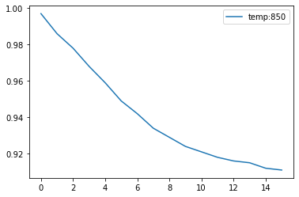
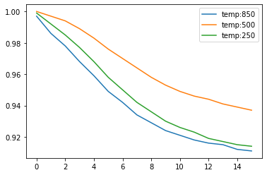
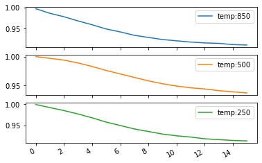
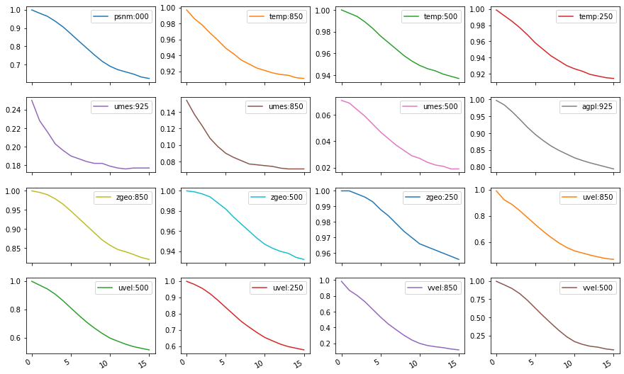
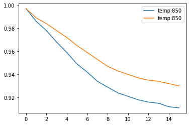

# Explorando os dataframes

Dataframes do Pandas são estruturas de dados tabulados que possuem uma série de funções e métodos que podem também ser aplicados com as tabelas do SCANTEC. Veja nos exemplos a seguir, diferentes formas de selecionar as colunas e plotar os dados de forma individual ou agrupada.

No exemplo abaixo, é feita a seleção da coluna referente à correleção de anomalias da temperatura absoluta em 850 hPa. Para isso, utiliza-se o método `loc` para fazer a localização da variável no dataframe. O método `loc` em um dataframe do Pandas indexa os valores da tabela a partir dos índices da linha e da coluna, respectivamente (`loc[linha,coluna]`):

=== "Comando"

    ```python linenums="1"
    dTable['ACORX126_20200601002020081500T.scan'].loc[:,'temp:850']
    ```

=== "Resultado"

    ```python linenums="1"
    0     0.997
    1     0.986
    2     0.978
    3     0.968
    4     0.959
    5     0.949
    6     0.942
    7     0.934
    8     0.929
    9     0.924
    10    0.921
    11    0.918
    12    0.916
    13    0.915
    14    0.912
    15    0.911
    Name: temp:850, dtype: float64
    ```

O dataframe do Pandas permite também realizar a plotagem rápida da seleção realizada utilizando a função `plot()`. Veja no exemplo a seguir:

=== "Comando"

    ```python linenums="1"
    dTable['ACORX126_20200601002020081500T.scan'].loc[:,['temp:850']].plot();
    ```

=== "Resultado"
    
    
    
Com o método `loc`, é possível também escolher mais do que uma coluna. Veja o exemplo a seguir e compare-o com o exemplo anterior:

=== "Comando"

    ```python linenums="1"
    dTable['ACORX126_20200601002020081500T.scan'].loc[:,['temp:850', 'temp:500', 'temp:250']].plot();
    ```
=== "Resultado"

    
    

O método `loc` realiza a indexação a partir dos rótulos das colunas. Utilize o método `iloc` para realizar a subseleção a partir dos índices das linhas e colunas:


=== "Comando"

    ```python linenums="1"
    axes = dTable['ACORX126_20200601002020081500T.scan'].iloc[:,2:5].plot()
    ```

=== "Resultado"
  
    
    

Quando múltiplas colunas são selecionadas, pode-se optar pela plotagem em grupo. Para isso, basta passar o argumento `subplots=True` para dentro da função `plot()`:

=== "Comando"

    ```python linenums="1"
    dTable['ACORX126_20200601002020081500T.scan'].loc[:,['temp:850', 'temp:500', 'temp:250']].plot(subplots=True);
    ```

=== "Resultado"
    
    
    

Veja a seguir o mesmo exemplo anterior, mas utilizando o método `iloc`:


=== "Comando"

    ```python linenums="1"
    axes = dTable['ACORX126_20200601002020081500T.scan'].iloc[:,2:5].plot(subplots=True)
    ```

=== "Resultado"
    
    
    

Outras opções de plotagem com o Matplotlib podem ser passadas também para a função `plot()`, veja a seguir:

=== "Comando"

    ```python linenums="1"
    axes = dTable['ACORX126_20200601002020081500T.scan'].iloc[:,1:-1].plot.line(subplots=True, figsize=(15,10), layout=(4,4), sharex=True)
    ```

=== "Resultado"
    
    
    
Com mais do que um experimento, é possível também plotá-los no mesmo gráfico. Veja a seguir como plotar duas colunas de dois dataframes diferentes (ie., duas tabelas do SCANTEC), no mesmo gráfico:

=== "Comando"

    ```python linenums="1"
    df_exp1 = dTable['ACORX126_20200601002020081500T.scan'].loc[:,['temp:850']]
    df_exp2 = dTable['ACORT126_20200601002020081500T.scan'].loc[:,['temp:850']]
    ax = df_exp1.plot(label=['exp1', 'exp2'])
    df_exp2.plot(ax=ax);
    ```

=== "Resultado"
    
    
