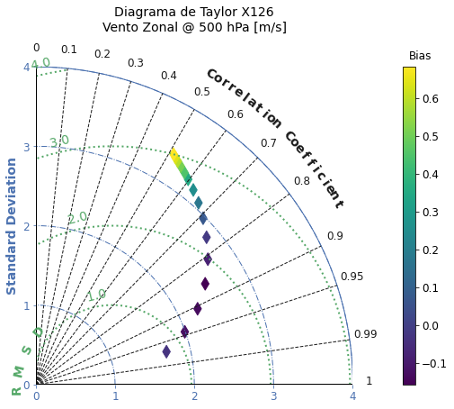
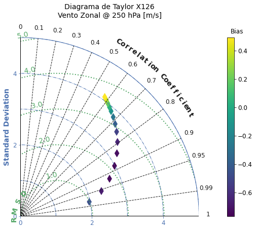
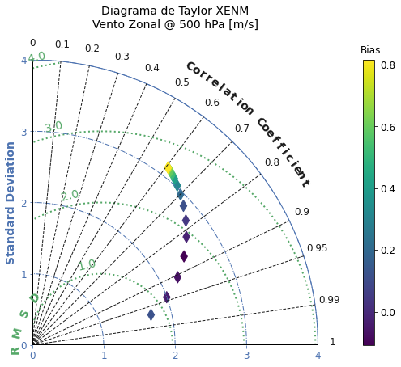
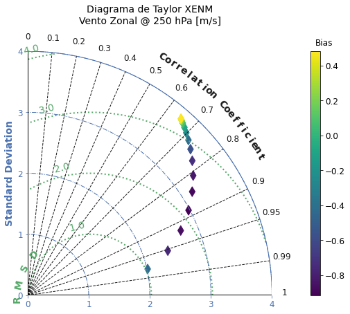
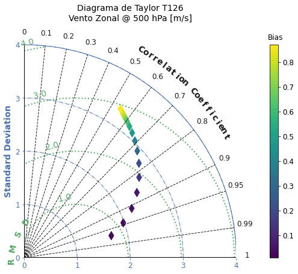
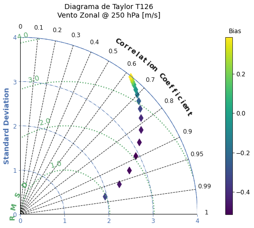
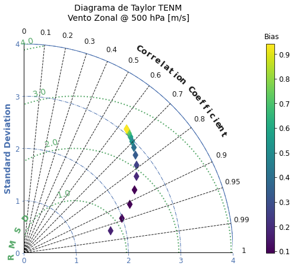
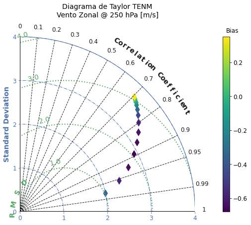

# plot_dTaylor

O diagrama de Taylor, semelhante ao scorecard, também possui a característica de resumir estatísticas básicas em um único diagrama. A função `plot_dTaylor` utiliza o módulo `SkillMetrics` (veja mais detalhes sobre este módulo em [SkillMetrics](https://pypi.org/project/SkillMetrics/)) para plotar o diagrama de Taylor a partir das tabelas do SCANTEC.

!!! bug "Cuidado"

    Esta função está implementada mas ainda não foi testada e pode conter bugs. 

Para acessar a documentação da função `plot_dTaylor`, utilize o comando a seguir:


=== "Comando"

    ``` python linenums="1"
    help(scanplot.plot_dTaylor)
    ```

=== "Resultado"

    ```python linenums="1"
    Help on function plot_dTaylor in module plot_functions:
    
    plot_dTaylor(dTable, data_conf, Vars, Stats, outDir, **kwargs)
        plot_dTaylor
        ============
        
        Esta função plota o diagrama de Taylor a partir das tabelas de estatísticas
        do SCANTEC, para um ou mais experimentos.
        
        Esta função utiliza o módulo SkillMetrics (https://pypi.org/project/SkillMetrics/). 
        
        Parâmetros de entrada
        ---------------------
            dTable    : objeto dicionário com uma ou mais tabelas do SCANTEC;
            Vars      : lista com os nomes e níveis das variáveis;
            data_conf : objeto dicionário com as configurações do SCANTEC;
            Stats     : lista com os nomes das estatísticas a serem processadas
                        (são necessárias as tabelas ACOR, RMSE e VIES);
            outDir    : string com o diretório com as tabelas do SCANTEC.
        
        Parâmetros de entrada opcionais
        -------------------------------
            showFig : valor Booleano para mostrar ou não as figuras durante a plotagem:
                      * showFig=False (valor padrão), não mostra as figuras (mais rápido);
                      * showFig=True, mostra as figuras (mais lento);
            saveFig : valor Booleano para salvar ou não as figuras durante a plotagem:
                      * saveFig=False (valor padrão), não salva as figuras;
                      * saveFig=True, salva as figuras;
            figDir  : string com o diretório onde as figuras serão salvas.
        
        Resultado
        ---------
            Figuras salvas no diretório definido na variável outDir ou figDir. Se figDir não
            for passado, então as figuras são salvas no diretório outDir (SCANTEC/dataout).
        
        Uso
        ---
            import scanplot 
            
            data_vars, data_conf = scanplot.read_namelists("~/SCANTEC")
            
            dataInicial = data_conf["Starting Time"]
            dataFinal = data_conf["Ending Time"]
            Vars = list(map(data_vars.get,[*data_vars.keys()]))
            Stats = ["ACOR", "RMSE", "VIES"]
            Exps = list(data_conf["Experiments"].keys())
            outDir = data_conf["Output directory"]
            
            figDir = data_conf["Output directory"]
        
            dTable = scanplot.get_dataframe(dataInicial,dataFinal,Stats,Exps,outDir)
            
            scanplot.plot_dTaylor(dTable,data_conf,Vars,Stats,outDir,figDir=figDir,showFig=True,saveFig=True)       
        
        Observações
        -----------
            Experimental, esta função considera o devio-padrão como a raiz quadrada do RMSE.
    ```

A função `plot_dTaylor` permite que sejam selecionadas uma ou mais variáveis, as quais serão plotadas em diagramas separados. O mesmo acontece com os experimentos. Para ilustrar o uso da função `plot_dTaylor`, serão escolhidas duas variáveis dos experimentos avalidados pelo SCANTEC.

=== "Comando"

    ``` py linenums="1"
    Vars = list(map(data_vars.get,[12,13]))
    ```

Observe o parâmetros `data_conf`, que é o dicionário criado e que contém as configurações do SCANTEC, inclusive os  prefixos (eg., `EXP01`, `EXP02` etc) dos experimentos:


=== "Comando"

    ``` py linenums="1"
    scanplot.plot_dTaylor(dTable, data_conf, Vars,
                          Stats, outDir, figDir=figDir,
                          showFig=True, saveFig=True)
    ```

=== "Resultado"

    
        
    
        
    
    
    
        
    
        
    
        
    
        
    
