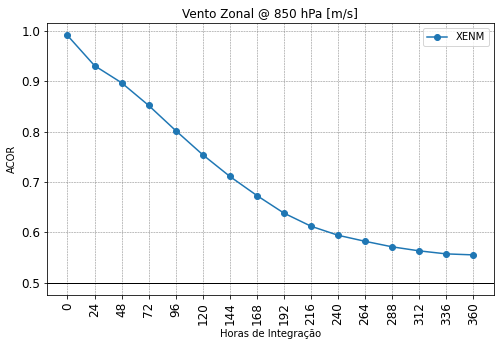
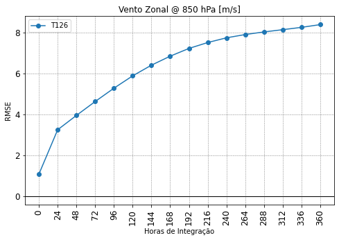

# plot_lines

A função `plot_lines` realiza a plotagem das tabelas selecionadas a partir da utilização da função `get_dataframe`. Assim como foi feito anteriormente para as outras funções do SCANPLOT, a ajuda da função pode ser acessada com um dos comandos a seguir:


=== "Comando"

    ```python linenums="1"
    help(scanplot.plot_lines)
    ```

=== "Resultado"
 
    ```py linenums="1"
    Help on function plot_lines in module plot_functions:
    
    plot_lines(dTable, Vars, Stats, outDir, **kwargs)
        plot_lines
        ==========
        
        Esta função plota gráficos de linha a partir de um dicionário de dataframes com as tabelas do SCANTEC.
        
        Parâmetros de entrada
        ---------------------
            dTable : objeto dicionário com uma ou mais tabelas do SCANTEC;
            Vars   : lista com os nomes e níveis das variáveis;
            Stats  : lista com os nomes das estatísticas a serem processadas;
            outDir : string com o diretório com as tabelas do SCANTEC.
        
        Parâmetros de entrada opcionais
        -------------------------------
            showFig    : valor Booleano para mostrar ou não as figuras durante a plotagem
                         showFig=False (valor padrão), não mostra as figuras (mais rápido)
                         showFig=True, mostra as figuras (mais lento);
            saveFig    : valor Booleano para salvar ou não as figuras durante a plotagem:
                         * saveFig=False (valor padrão), não salva as figuras;
                         * saveFig=True, salva as figuras;
            lineStyles : lista com as cores e os estilos das linhas (o número de elementos
                         da lista deve ser igual ao número de experimentos);
            figDir     : string com o diretório onde as figuras serão salvas;
            combine    : valor Booleano para combinar as curvas dos experimentos em um só gráfico:
                         * combine=False (valor padrão), plota as curvas em gráficos separados;
                         * combine=True, plota as curvas das mesmas estatísticas no mesmo gráfico;
            tExt       : string com o extensão dos nomes das tabelas do SCANTEC:
                         * tExt='scan' (valor padrão), considera as tabelas do SCANTEC;
                         * tExt='scam', considera os nomes das tabelas das versões antigas do SCANTEC.
        
        Resultado
        ---------
            Figuras salvas no diretório definido na variável outDir ou figDir. Se figDir não
            for passado, então as figuras são salvas no diretório outDir (SCANTEC/dataout).
        
        Uso
        ---
            import scanplot 
            
            data_vars, data_conf = scanplot.read_namelists("~/SCANTEC")
            
            dataInicial = data_conf["Starting Time"]
            dataFinal = data_conf["Ending Time"]
            Vars = list(map(data_vars.get,[*data_vars.keys()]))
            Stats = ["ACOR", "RMSE", "VIES"]
            Exps = list(data_conf["Experiments"].keys())
            outDir = data_conf["Output directory"]
           
            figDir = data_conf["Output directory"]
        
            lineStyles = ['k-', 'b-', 'b--', 'r-', 'r--']
        
            dTable = scanplot.get_dataframe(dataInicial,dataFinal,Stats,Exps,outDir)
            
            scanplot.plot_lines(dTable,Vars,Stats,outDir,showFig=True,saveFig=True,lineStyles=lineStyles,figDir=figDir)
    ``` 

Veja que a função `plot_lines` recebe como parâmetros de entrada o dicionário `dTable`, as listas `Vars` e `Stats` e o diretório de saída `outDir` que será utilizado para salvar as figuras produzidas. A função `plot_lines` possui parâmetros opcionais tais como `showFig` e `saveFig`, que permitem apresentar e salvar as figuras em disco, além de `lineStyles`, uma lista com cores e marcadores para cada experimento a ser plotado. Além disso, a opção `figDir`, permite que um diretório diferente seja utilizado para salvar as figuras. Alguns destes parâmetros opcionais também podem ser utilizados com as demais funções de plotagem do SCANPLOT.

Veja a seguir como utilizar a função `plot_lines`:

=== "Comando"

    ```python linenums="1"
    scanplot.plot_lines(dTable, Vars, Stats, 
                        outDir, figDir=figDir, 
                        showFig=True, saveFig=True,
                        combine=False)
    ```
=== "Resultado"

    
        
    
        
    
        
    
        
    
        
    
        
    
        
    
        
    
        
    
        
    
        
    
        
    
        
    
        
    
        
    
        
    
        
    
        
    
        
    
        
    
        
    
        
    
        
    
        
    
        
    
        
    
        
    
        
    
        
    
        
    
        
    
        
    
        
    
        
    
        
    
    
Na função `plot_lines`, o parâmetro `combine=True` permite que as curvas dos experimentos sejam combinadas de acordo com a lista de variáveis `Vars` e estatísticas `Stats`. Veja o exemplo a seguir:


=== "Comando"

    ```python linenums="1"
    scanplot.plot_lines(dTable, Vars, Stats,
                        outDir, figDir=figDir,
                        showFig=True, saveFig=True,
                        combine=True)
    ```

=== "Resultado"

    
        
    
        
    
        
    
        
    
        
    
        
    
        
    
        
    


A função `plot_lines` permite também que uma lista com cores e estilos de linhas seja passada como argumento da função. Veja no exemplo a seguir que uma lista de nome `lineStyles` é criada e passada como argumento da função. Observe que a ordem dos atributos (ie., cores e estilos de linha) serão aplicados de acordo com a ordem dos experimentos a serem plotados. Esta opção pode ser útil quando deseja-se que um dos experimentos seja destacado, com um estilo de linha e cor distintos.

=== "Comando"

    ```python linenums="1"
    lineStyles = ['k--', 'r-', 'g-', 'b-']

    scanplot.plot_lines(dTable, Vars, Stats,
                        outDir, figDir=figDir,
                        lineStyles=lineStyles,
                        showFig=True, saveFig=True, combine=True)
    ```

=== "Resultado"
   
    
        
    
        
    
        
    
        
    
        
    
        
    
        
    
        
    
