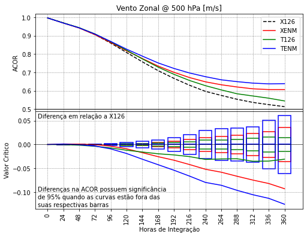
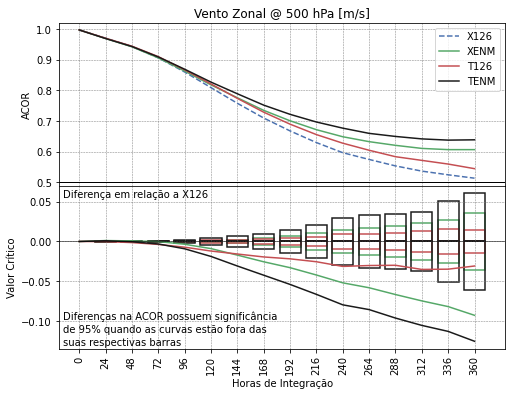

# plot_lines_tStudent

A partir das tabelas de correlação de anomalia do SCANTEC, é possível calcular a Transformada de Fisher e utilizar os valores da transformada para o cálculo do teste de significância. Este cálculo baseia-se no documento "Significance Testing for Forecast Skills[^2]". A função `plot_lines_tStudent` é utilizada para este propósito. Porém, diferentemente da função `plot_lines`, para usar a função `plot_lines_tStudent`, é necessário executar o SCANTEC para o período desejado e também para os intervalos dentro do período desejado. Dessa forma, se a intenção do usuário é avaliar o modelo para o período entre 2020060100 e 2020083100, será necessário também realizar a avaliação para os intervalos de tempo entre estas duas datas, ie., com frequência a cada 6, 12 ou 24 horas. Neste tipo de avaliação, no namelist `scantec.conf` as variáveis `Starting Time` e `Ending Time` são sempre iguais e elas podem ser atualizadas com o auxílio de algum script que se encarregue de calcular as novas datas.

[^2]: Disponível em [https://gmao.gsfc.nasa.gov/research/atmosphericassim/AVHRR/skilldiff_desc.pdf](https://gmao.gsfc.nasa.gov/research/atmosphericassim/AVHRR/skilldiff_desc.pdf)

Para acessar a documentação da função `plot_lines_tStudent`, basta utilizar o comando a seguir:

=== "Comando"

    ```python linenums="1"
    help(scanplot.plot_lines_tStudent)
    ```

=== "Resultado"

    ```python linenums="1"
    Help on function plot_lines_tStudent in module plot_functions:
    
    plot_lines_tStudent(dataInicial, dataFinal, dTable_series, Exps, Var, VarName, ldrom_exp, ldrosup_exp, ldroinf_exp, varlev_exps, outDir, **kwargs)
        plot_lines_tStudent
        ===================
        
        Esta função plota gráficos de linha acompanhados dos resultados do teste de significância t-Student.
        Os gráficos são plotados apenas com base nas tabelas de correlação de anomalia do SCANTEC.
        
        Parâmetros de entrada
        ---------------------
            Exps        : lista com os nomes dos experimentos;
            ldrom_exp   : curva do teste referente ao experimento;
            ldrosup_exp : limite superior do teste;
            ldroinf_exp : limite inferior do teste;
            varlev_exps : dataframes com as variáveis dos experimentos.
        
        Parâmetros de entrada opcionais
        -------------------------------
            showFig : valor Booleano para mostrar ou não as figuras durante a plotagem:
                      * showFig=False (valor padrão), não mostra as figuras (mais rápido);
                      * showFig=True, mostra as figuras (mais lento);
            saveFig : valor Booleano para salvar ou não as figuras durante a plotagem:
                      * saveFig=False (valor padrão), não salva as figuras;
                      * saveFig=True, salva as figuras;
            figDir  : string com o diretório onde as figuras serão salvas.
        
        Resultado
        ---------
            Resultado do teste de significância e valores críticos para serem utilizados pela função
            plot_lines_tStudent. Figuras salvas no diretório definido na variável outDir ou figDir. 
            Se figDir não for passado, então as figuras são salvas no diretório outDir (SCANTEC/dataout).
        
        Uso
        ---
            import scanplot 
            
            data_vars, data_conf = scanplot.read_namelists("~/SCANTEC")
            
            dataInicial = data_conf["Starting Time"]
            dataFinal = data_conf["Ending Time"]
            Vars = list(map(data_vars.get,[*data_vars.keys()]))
            Stats = ["ACOR", "RMSE", "VIES"]
            Exps = list(data_conf["Experiments"].keys())
            outDir = data_conf["Output directory"]
           
            Var = Vars[0][0].lower()
            VarName = Vars[0][1]
        
            dTable = scanplot.get_dataframe(dataInicial,dataFinal,Stats,Exps,outDir,series=False)
        
            dTable_series = scanplot.get_dataframe(dataInicial,dataFinal,Stats,Exps,outDir,series=True)
        
            varlev_exps = scanplot.concat_tables_and_loc(dTable,dataInicial,dataFinal,Exps,series=False)
           
            varlev_dia_exps = scanplot.concat_tables_and_loc(dTable_series,dataInicial,dataFinal,Exps,Var,series=True)
        
            lst_varlev_dia_exps_rsp = scanplot.df_fill_nan(varlev_exps,varlev_dia_exps)
            
            ldrom_exp, ldrosup_exp, ldroinf_exp = scanplot.calc_tStudent(lst_varlev_dia_exps_rsp)
            
            scanplot.plot_lines_tStudent(dataInicial,dataFinal,dTable_series,Exps,Var,VarName,ldrom_exp,
                                         ldrosup_exp,ldroinf_exp,varlev_exps,outDir,
                                         figDir=figDir,saveFig=True,showFig=True)
        
        Observações
        -----------
            * Experimental, esta função necessita ser validada;
            * Na presente versão, apenas uma variável e nível pode ser plotada.
    ```

Através da documentação da função, o usuário deve observar que é necessário utilizar as seguintes funções:

* `concat_tables_and_loc`
* `df_fill_nan`
* `calc_tStudent`

Estas funções são auxiliares à função `plot_lines_tStudent` e, nesta versão do SCANPLOT, elas devem ser aplicadas manualmente.

Para obter a documentação das funções, basta utilizar o comando `print(funcao.__doc__)` ou `help(funcao)`.

Embora o nome da função `plot_lines_tStudent` seja semelhante ao nome da função `plot_lines`, o seu uso e requerimentos são diferentes. A função `plot_lines_tStudent` foi preparada para plotar os gráficos de correlação de anomalia para uma lista de experimentos. Os valores de correlação de anomalia são utilizados para o cálculo do teste de significância t-Student, que permite verificar a significância estatísticas dos resultados apresentados pelas curvas, quanto à sua diferença.

Antes de executar a função `get_dataframe`, a lista `Exps` será redefinida para que todos os experimentos  disponíveis possam ser avaliados:

=== "Comando"

    ```python linenums="1"
    Exps = list(data_conf['Experiments'].keys())
    ```

Para a utilização da função `plot_lines_tStudent`, é necessário carregar as tabelas de correlação de anomalia calculadas pelo SCANTEC para os intervalos dentro do período de avaliação. Para isso, a função `get_dataframe` deve ser utilizada com a opção `series=True`:

=== "Comando"

    ```python linenums="1"
    dTable_series = scanplot.get_dataframe(dataInicial,dataFinal,Stats,Exps,outDir,series=True)
    ```

Digite `dTable_series` para verificar a sua estrutura[^3]:

=== "Comando"

    ```python linenums="1"
    dTable_series
    ```

=== "Resultado"

    ```python linenums="1"
    {'ACORX126_20200601002020060100T.scan':     %Previsao  psnm:000  temp:850  temp:500  temp:250  umes:925  umes:850  \
     0           0     0.999     0.998     1.000     0.999     0.289     0.141   
     1          24     0.979     0.985     0.997     0.991     0.123     0.070   
     2          48     0.972     0.979     0.994     0.981     0.241     0.188   
     3          72     0.952     0.970     0.987     0.969     0.233     0.084   
     4          96     0.938     0.961     0.982     0.962     0.234     0.137   
     5         120     0.922     0.956     0.980     0.951     0.214     0.141   
     6         144     0.895     0.947     0.974     0.941     0.096     0.142   
     7         168     0.852     0.939     0.968     0.933     0.197     0.157   
     8         192     0.840     0.936     0.964     0.921     0.134     0.090   
     9         216     0.828     0.927     0.958     0.912     0.209     0.082   
     10        240     0.749     0.918     0.950     0.903     0.220     0.086   
     11        264     0.682     0.911     0.944     0.908     0.216     0.084   
     12        288     0.683     0.913     0.947     0.906     0.221     0.039   
     13        312     0.674     0.919     0.943     0.904     0.021     0.011   
     14        336     0.657     0.913     0.935     0.905     0.219     0.027   
     15        360     0.705     0.910     0.929     0.895     0.160     0.066   
     
         umes:500  agpl:925  zgeo:850  zgeo:500  zgeo:250  uvel:850  uvel:500  \
     0      0.025     0.997     1.000     1.000     1.000     0.990     0.997   
     1      0.059     0.985     0.996     0.999     1.000     0.928     0.970   
     2      0.046     0.967     0.992     0.998     0.999     0.892     0.940   
     3      0.063     0.942     0.983     0.994     0.996     0.846     0.890   
     4      0.050     0.921     0.976     0.991     0.993     0.788     0.836   
     5      0.055     0.900     0.969     0.988     0.991     0.729     0.780   
     6      0.036     0.881     0.958     0.983     0.989     0.697     0.726   
     7      0.020     0.864     0.939     0.976     0.984     0.675     0.701   
     8      0.011     0.851     0.931     0.972     0.981     0.642     0.674   
     9      0.016     0.838     0.924     0.968     0.978     0.616     0.661   
     10     0.002     0.813     0.880     0.954     0.971     0.523     0.563   
     11     0.014     0.798     0.849     0.942     0.964     0.502     0.529   
     12     0.019     0.793     0.854     0.943     0.964     0.517     0.526   
     13     0.009     0.793     0.843     0.938     0.960     0.506     0.481   
     14     0.009     0.794     0.837     0.933     0.955     0.488     0.461   
     15     0.023     0.792     0.859     0.937     0.955     0.534     0.470   
     
         uvel:250  vvel:850  vvel:500  vvel:250  
     0      0.999     0.982     0.995     0.998  
     1      0.978     0.868     0.950     0.961  
     2      0.954     0.782     0.894     0.912  
     3      0.912     0.698     0.783     0.813  
     4      0.843     0.640     0.747     0.709  
     5      0.801     0.545     0.689     0.656  
     6      0.770     0.485     0.561     0.572  
     7      0.745     0.393     0.446     0.505  
     8      0.721     0.244     0.303     0.332  
     9      0.697     0.221     0.225     0.193  
     10     0.622     0.143     0.096     0.032  
     11     0.581     0.040    -0.040    -0.069  
     12     0.566     0.106    -0.012    -0.029  
     13     0.531     0.057    -0.061    -0.068  
     14     0.506     0.030    -0.050    -0.089  
     15     0.515     0.116    -0.027    -0.043  ,
     'ACORXENM_20200601002020060100T.scan':     %Previsao  psnm:000  temp:850  temp:500  temp:250  umes:925  umes:850  \
     0           0     0.999     0.997     1.000     0.999     0.285     0.137   
     1          24     0.984     0.988     0.997     0.988     0.121     0.068   
     2          48     0.973     0.981     0.994     0.977     0.238     0.188   
     3          72     0.954     0.972     0.987     0.964     0.232     0.084   
     4          96     0.938     0.964     0.982     0.954     0.233     0.135   
     5         120     0.924     0.959     0.981     0.943     0.214     0.137   
     6         144     0.908     0.952     0.977     0.940     0.096     0.137   
     7         168     0.879     0.947     0.973     0.937     0.200     0.158   
     8         192     0.863     0.945     0.970     0.933     0.137     0.100   
     9         216     0.847     0.937     0.967     0.929     0.213     0.086   
     10        240     0.776     0.930     0.959     0.924     0.223     0.082   
     11        264     0.716     0.928     0.957     0.928     0.221     0.077   
     12        288     0.703     0.933     0.960     0.926     0.225     0.037   
     13        312     0.703     0.935     0.955     0.926     0.021     0.011   
     14        336     0.713     0.932     0.949     0.924     0.221     0.028   
     15        360     0.762     0.928     0.949     0.920     0.163     0.067   
     
         umes:500  agpl:925  zgeo:850  zgeo:500  zgeo:250  uvel:850  uvel:500  \
     0      0.017     0.995     1.000     1.000     1.000     0.990     0.997   
     1      0.041     0.984     0.996     0.999     1.000     0.937     0.968   
     2      0.037     0.967     0.992     0.998     0.998     0.903     0.940   
     3      0.047     0.946     0.983     0.994     0.996     0.855     0.890   
     4      0.041     0.927     0.976     0.990     0.993     0.798     0.835   
     5      0.046     0.907     0.970     0.988     0.991     0.750     0.786   
     6      0.033     0.890     0.965     0.985     0.989     0.735     0.751   
     7      0.018     0.880     0.952     0.981     0.986     0.715     0.740   
     8      0.012     0.872     0.942     0.976     0.984     0.690     0.709   
     9      0.016     0.864     0.932     0.970     0.979     0.668     0.688   
     10     0.003     0.842     0.896     0.958     0.973     0.582     0.604   
     11     0.011     0.831     0.870     0.951     0.969     0.549     0.578   
     12     0.013     0.828     0.865     0.951     0.969     0.550     0.552   
     13     0.011     0.829     0.859     0.946     0.966     0.576     0.551   
     14     0.012     0.831     0.863     0.944     0.963     0.589     0.565   
     15     0.021     0.831     0.885     0.947     0.964     0.650     0.598   
     
         uvel:250  vvel:850  vvel:500  vvel:250  
     0      0.999     0.982     0.995     0.998  
     1      0.977     0.882     0.947     0.960  
     2      0.954     0.798     0.893     0.911  
     3      0.911     0.712     0.781     0.804  
     4      0.842     0.659     0.732     0.691  
     5      0.813     0.553     0.684     0.661  
     6      0.796     0.522     0.604     0.614  
     7      0.777     0.462     0.508     0.553  
     8      0.759     0.351     0.386     0.414  
     9      0.727     0.272     0.280     0.276  
     10     0.660     0.154     0.112     0.069  
     11     0.639     0.078    -0.039    -0.051  
     12     0.623     0.138     0.021     0.033  
     13     0.622     0.185     0.116     0.101  
     14     0.622     0.147     0.082     0.077  
     15     0.628     0.134     0.043     0.093  ,
     'ACORT126_20200601002020060100T.scan':     %Previsao  psnm:000  temp:850  temp:500  temp:250  umes:925  umes:850  \
     0           0     0.999     0.998     1.000     0.999     0.289     0.141   
     1          24     0.981     0.988     0.997     0.991     0.129     0.072   
     2          48     0.977     0.985     0.994     0.981     0.258     0.194   
     3          72     0.962     0.979     0.987     0.971     0.252     0.088   
     4          96     0.948     0.974     0.983     0.964     0.256     0.148   
     5         120     0.933     0.970     0.980     0.955     0.234     0.162   
     6         144     0.903     0.962     0.975     0.945     0.105     0.165   
     7         168     0.868     0.955     0.969     0.934     0.218     0.194   
     8         192     0.859     0.950     0.964     0.923     0.150     0.110   
     9         216     0.847     0.940     0.958     0.917     0.244     0.098   
     10        240     0.777     0.935     0.953     0.905     0.262     0.105   
     11        264     0.705     0.930     0.948     0.908     0.254     0.090   
     12        288     0.681     0.933     0.942     0.898     0.256     0.041   
     13        312     0.653     0.935     0.934     0.896     0.027     0.014   
     14        336     0.690     0.928     0.931     0.898     0.249     0.031   
     15        360     0.769     0.929     0.934     0.901     0.182     0.072   
     
         umes:500  agpl:925  zgeo:850  zgeo:500  zgeo:250  uvel:850  uvel:500  \
     0      0.025     0.997     1.000     1.000     1.000     0.991     0.997   
     1      0.059     0.987     0.996     0.999     1.000     0.933     0.970   
     2      0.047     0.974     0.993     0.998     0.999     0.899     0.941   
     3      0.065     0.959     0.984     0.994     0.996     0.857     0.894   
     4      0.057     0.949     0.978     0.991     0.994     0.812     0.847   
     5      0.057     0.936     0.970     0.988     0.992     0.761     0.790   
     6      0.042     0.920     0.958     0.984     0.989     0.712     0.741   
     7      0.028     0.912     0.943     0.978     0.986     0.704     0.720   
     8      0.022     0.906     0.937     0.974     0.982     0.683     0.702   
     9      0.033     0.895     0.933     0.971     0.980     0.650     0.681   
     10     0.010     0.885     0.898     0.962     0.975     0.555     0.595   
     11     0.024     0.876     0.864     0.953     0.971     0.514     0.545   
     12     0.023     0.875     0.853     0.948     0.965     0.470     0.493   
     13     0.033     0.870     0.837     0.938     0.958     0.454     0.448   
     14     0.026     0.876     0.859     0.940     0.957     0.524     0.493   
     15     0.032     0.879     0.891     0.947     0.961     0.578     0.553   
     
         uvel:250  vvel:850  vvel:500  vvel:250  
     0      0.999     0.985     0.995     0.998  
     1      0.978     0.877     0.951     0.962  
     2      0.957     0.792     0.895     0.913  
     3      0.919     0.715     0.795     0.819  
     4      0.862     0.673     0.760     0.729  
     5      0.818     0.588     0.696     0.687  
     6      0.788     0.520     0.565     0.584  
     7      0.770     0.424     0.442     0.492  
     8      0.746     0.296     0.285     0.351  
     9      0.716     0.283     0.246     0.237  
     10     0.646     0.226     0.187     0.154  
     11     0.606     0.150     0.109     0.120  
     12     0.547     0.139     0.043     0.004  
     13     0.528     0.191     0.055    -0.048  
     14     0.548     0.198     0.089     0.059  
     15     0.589     0.160     0.060     0.114  ,
     'ACORTENM_20200601002020060100T.scan':     %Previsao  psnm:000  temp:850  temp:500  temp:250  umes:925  umes:850  \
     0           0     0.999     0.997     1.000     0.999     0.285     0.137   
     1          24     0.987     0.990     0.997     0.988     0.127     0.070   
     2          48     0.978     0.987     0.994     0.978     0.256     0.193   
     3          72     0.963     0.981     0.988     0.966     0.250     0.088   
     4          96     0.951     0.976     0.983     0.958     0.253     0.145   
     5         120     0.937     0.972     0.982     0.949     0.231     0.157   
     6         144     0.919     0.966     0.977     0.944     0.105     0.162   
     7         168     0.897     0.962     0.973     0.939     0.219     0.193   
     8         192     0.888     0.961     0.972     0.937     0.151     0.117   
     9         216     0.880     0.955     0.968     0.933     0.242     0.103   
     10        240     0.809     0.950     0.964     0.927     0.259     0.098   
     11        264     0.759     0.949     0.963     0.930     0.259     0.089   
     12        288     0.751     0.953     0.963     0.927     0.261     0.045   
     13        312     0.729     0.956     0.960     0.926     0.025     0.012   
     14        336     0.748     0.953     0.954     0.928     0.259     0.032   
     15        360     0.812     0.950     0.953     0.926     0.190     0.079   
     
         umes:500  agpl:925  zgeo:850  zgeo:500  zgeo:250  uvel:850  uvel:500  \
     0      0.017     0.995     1.000     1.000     1.000     0.991     0.997   
     1      0.043     0.985     0.996     0.999     1.000     0.941     0.969   
     2      0.038     0.974     0.993     0.998     0.999     0.909     0.941   
     3      0.050     0.962     0.985     0.994     0.996     0.868     0.896   
     4      0.045     0.953     0.979     0.991     0.994     0.821     0.850   
     5      0.051     0.941     0.971     0.988     0.992     0.779     0.800   
     6      0.036     0.928     0.965     0.985     0.989     0.752     0.763   
     7      0.024     0.924     0.957     0.982     0.987     0.749     0.755   
     8      0.017     0.923     0.950     0.979     0.986     0.734     0.736   
     9      0.030     0.920     0.946     0.976     0.983     0.720     0.729   
     10     0.016     0.911     0.913     0.967     0.979     0.624     0.651   
     11     0.023     0.903     0.891     0.962     0.976     0.593     0.619   
     12     0.026     0.904     0.890     0.962     0.975     0.592     0.602   
     13     0.036     0.905     0.880     0.957     0.972     0.607     0.608   
     14     0.030     0.905     0.887     0.955     0.969     0.620     0.617   
     15     0.039     0.906     0.911     0.958     0.969     0.692     0.647   
     
         uvel:250  vvel:850  vvel:500  vvel:250  
     0      0.999     0.985     0.995     0.998  
     1      0.978     0.892     0.948     0.961  
     2      0.956     0.809     0.895     0.914  
     3      0.919     0.736     0.794     0.814  
     4      0.862     0.687     0.748     0.715  
     5      0.829     0.595     0.693     0.685  
     6      0.808     0.557     0.603     0.614  
     7      0.798     0.504     0.512     0.561  
     8      0.790     0.405     0.391     0.457  
     9      0.764     0.378     0.351     0.366  
     10     0.705     0.302     0.271     0.270  
     11     0.681     0.235     0.179     0.188  
     12     0.668     0.271     0.208     0.200  
     13     0.675     0.344     0.275     0.219  
     14     0.657     0.315     0.293     0.230  
     15     0.664     0.250     0.211     0.228  ,
     'RMSEX126_20200601002020060100T.scan':     %Previsao  psnm:000  temp:850  temp:500  temp:250  umes:925  umes:850  \
     0           0     0.697     0.944     0.250     0.483     1.653     1.652   
     1          24     2.784     2.653     0.866     1.133     1.653     1.652   
     2          48     3.409     3.240     1.325     1.651     1.653     1.652   
     3          72     4.759     3.878     1.884     2.069     1.653     1.652   
     4          96     5.555     4.322     2.244     2.299     1.653     1.652   
     5         120     6.062     4.577     2.446     2.575     1.653     1.652   
     6         144     6.798     4.925     2.860     2.853     1.653     1.652   
     7         168     7.980     5.236     3.184     3.032     1.653     1.652   
     8         192     8.239     5.400     3.374     3.325     1.653     1.652   
     9         216     8.495     5.745     3.690     3.511     1.653     1.652   
     10        240    10.276     6.071     4.089     3.724     1.653     1.652   
     11        264    11.550     6.321     4.382     3.632     1.653     1.652   
     12        288    11.012     6.354     4.304     3.678     1.653     1.652   
     13        312    11.001     6.313     4.506     3.724     1.653     1.652   
     14        336    11.580     6.584     4.888     3.707     1.653     1.652   
     15        360    11.236     6.669     5.084     3.861     1.653     1.652   
     
         umes:500  agpl:925  zgeo:850  zgeo:500  zgeo:250  uvel:850  uvel:500  \
     0      1.649     1.281     2.765     2.412     4.027     1.158     0.946   
     1      1.649     2.789    14.367    15.005    17.193     3.101     2.852   
     2      1.649     4.147    20.206    27.635    33.299     3.966     3.977   
     3      1.649     5.476    30.811    43.123    53.418     4.924     5.449   
     4      1.649     6.356    36.653    51.629    68.195     5.735     6.368   
     5      1.649     7.104    41.124    57.636    78.571     6.348     7.068   
     6      1.649     7.741    46.893    67.157    91.055     6.562     7.698   
     7      1.649     8.295    56.274    78.039   105.386     6.903     8.027   
     8      1.650     8.719    60.227    85.361   115.235     7.205     8.575   
     9      1.650     9.109    63.007    91.588   126.772     7.383     8.672   
     10     1.650     9.817    78.278   107.779   143.569     8.497    10.060   
     11     1.650    10.226    87.356   119.817   157.845     8.891    10.638   
     12     1.650    10.390    84.176   119.580   158.560     8.703    10.862   
     13     1.650    10.417    87.472   126.660   168.651     8.679    11.433   
     14     1.650    10.368    90.257   132.937   182.309     8.839    11.717   
     15     1.650    10.392    86.318   130.630   183.497     8.453    11.545   
     
         uvel:250  vvel:850  vvel:500  vvel:250  
     0      0.978     1.109     0.912     0.978  
     1      3.766     3.035     2.755     3.700  
     2      5.331     3.743     3.876     5.330  
     3      7.415     4.509     5.124     7.063  
     4      9.410     5.024     5.696     8.890  
     5     10.376     5.639     6.559    10.181  
     6     10.976     5.961     7.675    11.394  
     7     11.562     6.441     8.501    12.289  
     8     12.415     7.115     9.250    13.807  
     9     13.021     7.450     9.856    15.219  
     10    14.621     7.880    10.620    16.302  
     11    15.393     8.447    11.464    16.948  
     12    15.834     8.347    11.781    16.897  
     13    16.530     8.605    12.083    17.427  
     14    17.097     8.883    12.197    17.948  
     15    17.168     8.946    12.449    18.662  ,
     'RMSEXENM_20200601002020060100T.scan':     %Previsao  psnm:000  temp:850  temp:500  temp:250  umes:925  umes:850  \
     0           0     0.689     1.040     0.280     0.485     1.653     1.652   
     1          24     2.409     2.349     0.895     1.848     1.653     1.652   
     2          48     3.346     3.083     1.310     2.274     1.653     1.652   
     3          72     4.675     3.747     1.820     2.632     1.653     1.652   
     4          96     5.510     4.211     2.153     2.824     1.653     1.652   
     5         120     5.939     4.452     2.265     3.003     1.653     1.652   
     6         144     6.351     4.717     2.542     3.065     1.653     1.652   
     7         168     7.154     4.910     2.830     3.081     1.653     1.652   
     8         192     7.433     5.028     2.971     3.171     1.653     1.652   
     9         216     7.702     5.351     3.200     3.297     1.653     1.652   
     10        240     9.304     5.613     3.568     3.416     1.653     1.652   
     11        264    10.373     5.715     3.730     3.332     1.653     1.652   
     12        288    10.116     5.645     3.694     3.397     1.653     1.652   
     13        312     9.890     5.637     3.916     3.365     1.653     1.652   
     14        336     9.974     5.785     4.171     3.348     1.653     1.652   
     15        360     9.429     5.930     4.185     3.386     1.653     1.652   
     
         umes:500  agpl:925  zgeo:850  zgeo:500  zgeo:250  uvel:850  uvel:500  \
     0      1.649     1.897     3.989     7.242     9.920     1.159     0.946   
     1      1.649     2.985    13.703    14.623    16.600     2.930     2.905   
     2      1.649     4.151    20.274    26.613    30.089     3.735     3.975   
     3      1.650     5.288    30.613    42.128    49.294     4.686     5.414   
     4      1.650     6.088    36.648    51.395    64.940     5.437     6.332   
     5      1.650     6.820    40.404    56.870    73.755     5.901     6.906   
     6      1.650     7.393    43.124    62.806    83.032     5.940     7.254   
     7      1.649     7.752    49.554    70.256    93.410     6.170     7.371   
     8      1.650     8.035    54.223    78.175   102.630     6.389     7.965   
     9      1.650     8.283    57.889    86.891   114.937     6.448     8.129   
     10     1.650     8.939    70.978   100.774   131.760     7.445     9.244   
     11     1.650     9.269    78.144   107.813   140.669     7.856     9.759   
     12     1.650     9.356    77.278   109.004   141.890     7.836    10.140   
     13     1.650     9.377    78.034   113.280   149.812     7.423    10.113   
     14     1.650     9.301    78.005   116.432   156.733     7.275    10.006   
     15     1.650     9.241    73.349   113.788   154.721     6.698     9.521   
     
         uvel:250  vvel:850  vvel:500  vvel:250  
     0      0.978     1.110     0.912     0.978  
     1      3.853     2.849     2.845     3.783  
     2      5.373     3.549     3.894     5.376  
     3      7.463     4.273     5.104     7.128  
     4      9.373     4.703     5.784     9.008  
     5      9.978     5.327     6.527    10.049  
     6     10.271     5.426     7.177    10.752  
     7     10.745     5.691     7.811    11.446  
     8     11.510     5.995     8.299    12.480  
     9     12.237     6.452     8.941    13.730  
     10    13.538     6.984     9.702    14.728  
     11    13.939     7.242    10.125    14.926  
     12    14.370     7.062    10.016    14.345  
     13    14.346     7.057     9.764    14.316  
     14    14.490     7.273    10.097    14.491  
     15    14.539     7.543    10.460    15.057  ,
     'RMSET126_20200601002020060100T.scan':     %Previsao  psnm:000  temp:850  temp:500  temp:250  umes:925  umes:850  \
     0           0     0.698     0.908     0.250     0.483     1.653     1.652   
     1          24     2.603     2.358     0.835     1.149     1.653     1.652   
     2          48     3.044     2.680     1.289     1.649     1.653     1.652   
     3          72     4.239     3.135     1.830     2.053     1.653     1.652   
     4          96     5.005     3.426     2.190     2.256     1.653     1.652   
     5         120     5.531     3.634     2.407     2.482     1.653     1.652   
     6         144     6.371     4.032     2.793     2.738     1.653     1.652   
     7         168     7.373     4.373     3.101     2.994     1.653     1.652   
     8         192     7.566     4.627     3.335     3.256     1.653     1.652   
     9         216     7.766     5.056     3.590     3.417     1.653     1.652   
     10        240     9.300     5.318     3.884     3.689     1.653     1.652   
     11        264    10.767     5.582     4.158     3.644     1.653     1.652   
     12        288    10.997     5.596     4.423     3.855     1.653     1.652   
     13        312    11.231     5.550     4.723     3.888     1.653     1.652   
     14        336    10.773     5.855     4.857     3.825     1.653     1.652   
     15        360     9.487     5.829     4.800     3.748     1.653     1.652   
     
         umes:500  agpl:925  zgeo:850  zgeo:500  zgeo:250  uvel:850  uvel:500  \
     0      1.649     1.303     2.811     2.386     4.031     1.087     0.946   
     1      1.649     2.646    13.844    12.688    14.429     3.007     2.830   
     2      1.649     3.676    19.337    23.989    28.305     3.862     3.942   
     3      1.649     4.633    29.240    39.040    47.857     4.763     5.339   
     4      1.649     5.103    34.896    46.580    60.298     5.374     6.167   
     5      1.650     5.755    40.016    53.722    71.427     5.856     6.932   
     6      1.650     6.417    46.144    62.712    83.895     6.279     7.538   
     7      1.649     6.747    53.705    72.104    95.898     6.393     7.874   
     8      1.650     7.043    56.717    79.965   106.780     6.627     8.315   
     9      1.650     7.421    58.207    84.421   115.666     6.892     8.549   
     10     1.650     7.807    71.083    95.749   127.375     7.978     9.844   
     11     1.650     8.136    82.211   106.938   139.486     8.534    10.628   
     12     1.650     8.181    85.059   114.065   152.619     9.012    11.339   
     13     1.650     8.387    89.091   124.464   168.437     8.990    11.885   
     14     1.650     8.183    83.795   124.281   172.960     8.437    11.482   
     15     1.650     8.029    74.171   117.083   166.837     7.894    10.693   
     
         uvel:250  vvel:850  vvel:500  vvel:250  
     0      0.978     1.030     0.912     0.978  
     1      3.721     2.929     2.727     3.632  
     2      5.153     3.658     3.855     5.300  
     3      7.136     4.357     4.969     6.921  
     4      8.847     4.722     5.538     8.565  
     5      9.948     5.315     6.474     9.753  
     6     10.614     5.681     7.631    11.204  
     7     11.072     6.194     8.496    12.360  
     8     11.955     6.749     9.335    13.541  
     9     12.707     6.976     9.622    14.682  
     10    14.245     7.392     9.928    15.158  
     11    15.107     7.929    10.362    15.259  
     12    16.329     8.059    11.180    16.444  
     13    16.630     7.876    11.404    17.227  
     14    16.369     7.901    11.343    16.459  
     15    15.773     8.372    11.782    16.542  ,
     'RMSETENM_20200601002020060100T.scan':     %Previsao  psnm:000  temp:850  temp:500  temp:250  umes:925  umes:850  \
     0           0     0.688     1.008     0.280     0.485     1.653     1.652   
     1          24     2.196     2.026     0.873     1.902     1.653     1.652   
     2          48     2.989     2.497     1.278     2.337     1.653     1.652   
     3          72     4.129     2.983     1.754     2.686     1.653     1.652   
     4          96     4.884     3.297     2.074     2.834     1.653     1.652   
     5         120     5.361     3.490     2.223     2.967     1.653     1.652   
     6         144     5.837     3.790     2.526     3.048     1.653     1.652   
     7         168     6.489     3.990     2.753     3.097     1.653     1.652   
     8         192     6.601     4.105     2.872     3.140     1.653     1.652   
     9         216     6.631     4.426     3.095     3.236     1.653     1.652   
     10        240     8.335     4.636     3.316     3.386     1.653     1.652   
     11        264     9.287     4.720     3.463     3.340     1.653     1.652   
     12        288     9.033     4.649     3.481     3.438     1.653     1.652   
     13        312     9.231     4.573     3.630     3.410     1.653     1.652   
     14        336     9.136     4.701     3.874     3.298     1.653     1.652   
     15        360     8.231     4.836     3.906     3.277     1.653     1.652   
     
         umes:500  agpl:925  zgeo:850  zgeo:500  zgeo:250  uvel:850  uvel:500  \
     0      1.649     1.917     4.044     7.248     9.938     1.089     0.946   
     1      1.649     2.845    13.209    12.695    18.090     2.825     2.886   
     2      1.649     3.725    19.521    23.329    28.726     3.623     3.929   
     3      1.650     4.510    28.802    37.977    45.912     4.493     5.275   
     4      1.650     4.960    34.399    46.127    58.931     5.125     6.062   
     5      1.650     5.576    39.171    53.005    68.653     5.470     6.692   
     6      1.650     6.135    42.277    59.184    78.836     5.657     7.121   
     7      1.649     6.324    46.971    65.059    86.297     5.688     7.231   
     8      1.650     6.399    49.946    71.596    93.297     5.836     7.680   
     9      1.650     6.499    50.984    76.725   101.834     5.801     7.681   
     10     1.650     6.853    64.227    88.072   113.806     6.922     8.802   
     11     1.650     7.137    71.078    95.065   122.700     7.375     9.402   
     12     1.650     7.103    69.973    96.200   125.104     7.432     9.695   
     13     1.650     7.085    72.710   100.980   133.901     7.110     9.584   
     14     1.650     7.066    71.203   103.707   141.710     6.988     9.523   
     15     1.650     6.990    64.782   100.923   140.294     6.311     9.061   
     
         uvel:250  vvel:850  vvel:500  vvel:250  
     0      0.978     1.031     0.912     0.978  
     1      3.798     2.731     2.814     3.709  
     2      5.220     3.449     3.855     5.304  
     3      7.129     4.089     4.957     6.958  
     4      8.798     4.479     5.622     8.689  
     5      9.564     5.081     6.448     9.768  
     6     10.001     5.221     7.192    10.749  
     7     10.282     5.453     7.780    11.365  
     8     10.835     5.732     8.244    12.101  
     9     11.488     5.994     8.559    13.047  
     10    12.721     6.392     8.962    13.438  
     11    13.230     6.617     9.139    13.474  
     12    13.597     6.498     9.145    13.303  
     13    13.403     6.390     9.054    13.557  
     14    13.857     6.621     9.245    13.559  
     15    13.912     7.049     9.750    14.160  ,
     'VIESX126_20200601002020060100T.scan':     %Previsao  psnm:000  temp:850  temp:500  temp:250  umes:925  umes:850  \
     0           0    -0.160    -0.079     0.045     0.217     1.653     1.651   
     1          24     0.165    -1.222    -0.189     0.352     1.653     1.652   
     2          48     0.096    -1.622    -0.347     0.407     1.653     1.652   
     3          72    -0.045    -1.868    -0.452     0.476     1.653     1.652   
     4          96     0.050    -1.951    -0.623     0.344     1.653     1.652   
     5         120    -0.002    -1.993    -0.825     0.232     1.653     1.651   
     6         144     0.324    -2.154    -1.100     0.101     1.653     1.651   
     7         168     0.419    -2.209    -1.204    -0.053     1.653     1.651   
     8         192     0.192    -2.315    -1.278    -0.174     1.653     1.652   
     9         216     0.194    -2.438    -1.384    -0.112     1.653     1.651   
     10        240     0.483    -2.544    -1.557    -0.069     1.652     1.651   
     11        264     0.487    -2.523    -1.717    -0.019     1.652     1.651   
     12        288     0.192    -2.701    -1.769     0.104     1.652     1.651   
     13        312     0.151    -2.887    -1.899    -0.050     1.652     1.651   
     14        336     0.284    -3.016    -2.100    -0.246     1.652     1.651   
     15        360     0.418    -2.988    -2.174    -0.338     1.652     1.651   
     
         umes:500  agpl:925  zgeo:850  zgeo:500  zgeo:250  uvel:850  uvel:500  \
     0      1.649    -0.036    -0.004     1.443     3.038    -0.004    -0.009   
     1      1.649    -0.111    -2.429    -9.564    -9.195    -0.059    -0.085   
     2      1.649    -0.236    -4.654   -16.573   -17.548    -0.195    -0.190   
     3      1.649    -0.408    -6.320   -21.581   -22.572    -0.210    -0.166   
     4      1.649    -0.483    -5.892   -23.645   -27.305    -0.374    -0.211   
     5      1.650    -0.609    -6.589   -26.208   -33.949    -0.636    -0.187   
     6      1.649    -0.628    -4.715   -28.307   -40.081    -0.805    -0.275   
     7      1.649    -0.584    -4.030   -30.170   -44.799    -0.932    -0.154   
     8      1.650    -0.605    -6.018   -33.229   -49.619    -0.880    -0.017   
     9      1.650    -0.756    -6.572   -35.319   -53.746    -0.835     0.046   
     10     1.649    -0.871    -5.022   -35.637   -57.117    -0.810    -0.019   
     11     1.650    -1.025    -4.854   -36.691   -59.009    -0.812     0.358   
     12     1.649    -1.175    -7.585   -41.682   -63.582    -0.516     0.478   
     13     1.650    -1.122    -7.841   -44.337   -68.978    -0.568     0.457   
     14     1.649    -1.131    -7.515   -46.624   -74.882    -0.600     0.488   
     15     1.650    -1.193    -6.690   -46.628   -76.697    -0.547     0.440   
     
         uvel:250  vvel:850  vvel:500  vvel:250  
     0     -0.066     0.010    -0.004     0.002  
     1     -0.401     0.052     0.070     0.136  
     2     -0.636     0.194     0.064     0.150  
     3     -0.525     0.124     0.098     0.061  
     4     -0.824     0.183     0.068    -0.037  
     5     -0.747     0.006    -0.000     0.089  
     6     -0.748     0.146     0.023     0.163  
     7     -0.529     0.072     0.068     0.077  
     8     -0.219    -0.072     0.067     0.129  
     9     -0.441    -0.025     0.020     0.210  
     10    -0.384     0.154    -0.026     0.375  
     11    -0.044     0.086     0.023     0.175  
     12     0.188     0.007     0.179     0.097  
     13     0.144    -0.111     0.112     0.212  
     14     0.061    -0.091     0.166     0.439  
     15     0.154     0.014     0.068     0.185  ,
     'VIESXENM_20200601002020060100T.scan':     %Previsao  psnm:000  temp:850  temp:500  temp:250  umes:925  umes:850  \
     0           0    -0.139     0.063     0.073     0.221     1.653     1.651   
     1          24     0.074    -1.066    -0.036     1.388     1.653     1.652   
     2          48     0.094    -1.560    -0.137     1.491     1.653     1.652   
     3          72    -0.067    -1.837    -0.202     1.510     1.653     1.652   
     4          96     0.009    -1.925    -0.324     1.341     1.653     1.652   
     5         120    -0.079    -1.953    -0.483     1.183     1.653     1.651   
     6         144     0.200    -2.103    -0.714     1.014     1.653     1.651   
     7         168     0.320    -2.149    -0.850     0.804     1.653     1.651   
     8         192     0.221    -2.246    -0.964     0.656     1.653     1.652   
     9         216     0.237    -2.353    -1.065     0.652     1.653     1.651   
     10        240     0.460    -2.455    -1.250     0.631     1.652     1.651   
     11        264     0.493    -2.461    -1.465     0.629     1.652     1.651   
     12        288     0.283    -2.602    -1.578     0.661     1.652     1.651   
     13        312     0.376    -2.700    -1.660     0.477     1.652     1.651   
     14        336     0.526    -2.739    -1.814     0.240     1.652     1.651   
     15        360     0.711    -2.745    -1.831     0.049     1.652     1.651   
     
         umes:500  agpl:925  zgeo:850  zgeo:500  zgeo:250  uvel:850  uvel:500  \
     0      1.649     1.059     0.865     3.647     6.148    -0.004    -0.009   
     1      1.649     0.613    -2.396    -8.230     5.966    -0.193     0.060   
     2      1.649     0.519    -4.403   -14.821    -1.041    -0.168    -0.129   
     3      1.649     0.330    -6.401   -19.748    -5.736    -0.166    -0.106   
     4      1.649     0.224    -6.093   -21.558   -10.039    -0.309    -0.158   
     5      1.650     0.080    -6.931   -23.848   -16.419    -0.575    -0.170   
     6      1.650    -0.002    -5.429   -25.764   -22.437    -0.710    -0.231   
     7      1.649    -0.021    -4.472   -27.299   -27.846    -0.786    -0.163   
     8      1.650    -0.107    -5.519   -29.662   -32.688    -0.759     0.001   
     9      1.650    -0.279    -6.053   -31.641   -36.769    -0.667     0.159   
     10     1.649    -0.435    -4.949   -32.384   -41.472    -0.684     0.213   
     11     1.650    -0.589    -4.446   -33.673   -44.980    -0.587     0.443   
     12     1.649    -0.757    -6.389   -38.070   -50.497    -0.467     0.439   
     13     1.650    -0.797    -5.721   -38.939   -53.599    -0.519     0.251   
     14     1.649    -0.813    -4.784   -39.817   -57.828    -0.553     0.241   
     15     1.650    -0.884    -3.712   -39.148   -59.774    -0.604     0.241   
     
         uvel:250  vvel:850  vvel:500  vvel:250  
     0     -0.066     0.009    -0.004     0.001  
     1     -0.381     0.043     0.093     0.120  
     2     -0.691     0.105     0.044     0.199  
     3     -0.659     0.098     0.103    -0.013  
     4     -0.953     0.210     0.079    -0.040  
     5     -0.847     0.091     0.053     0.050  
     6     -0.883     0.150     0.005     0.114  
     7     -0.790     0.029     0.076     0.114  
     8     -0.487    -0.058     0.083     0.173  
     9     -0.574    -0.023     0.043     0.224  
     10    -0.506     0.024     0.029     0.343  
     11    -0.269     0.073     0.043     0.211  
     12    -0.192     0.016     0.205     0.096  
     13    -0.418    -0.170     0.150     0.138  
     14    -0.574    -0.127     0.118     0.263  
     15    -0.507    -0.022     0.096     0.157  ,
     'VIEST126_20200601002020060100T.scan':     %Previsao  psnm:000  temp:850  temp:500  temp:250  umes:925  umes:850  \
     0           0    -0.184    -0.060     0.045     0.217     1.653     1.652   
     1          24     0.114    -0.926    -0.114     0.434     1.653     1.652   
     2          48     0.061    -1.143    -0.234     0.575     1.653     1.652   
     3          72    -0.091    -1.265    -0.328     0.717     1.653     1.652   
     4          96     0.026    -1.261    -0.490     0.624     1.653     1.652   
     5         120    -0.020    -1.229    -0.692     0.504     1.653     1.652   
     6         144     0.273    -1.300    -0.917     0.390     1.653     1.652   
     7         168     0.328    -1.332    -1.016     0.240     1.653     1.652   
     8         192     0.104    -1.389    -1.030     0.136     1.653     1.652   
     9         216     0.050    -1.454    -1.068     0.171     1.653     1.652   
     10        240     0.213    -1.572    -1.213     0.205     1.653     1.652   
     11        264     0.219    -1.636    -1.454     0.327     1.653     1.652   
     12        288     0.050    -1.844    -1.626     0.425     1.653     1.652   
     13        312     0.047    -1.946    -1.715     0.258     1.653     1.652   
     14        336     0.170    -2.052    -1.862     0.016     1.653     1.652   
     15        360     0.368    -2.068    -1.910    -0.185     1.653     1.652   
     
         umes:500  agpl:925  zgeo:850  zgeo:500  zgeo:250  uvel:850  uvel:500  \
     0      1.649    -0.033    -0.064     1.471     3.068    -0.029    -0.009   
     1      1.649    -0.068    -0.120    -5.939    -4.090    -0.013    -0.035   
     2      1.649    -0.084    -1.037   -10.423    -8.864    -0.065    -0.086   
     3      1.649    -0.100    -2.065   -13.916   -11.786    -0.101     0.008   
     4      1.649    -0.015    -0.973   -14.896   -14.698    -0.154    -0.050   
     5      1.650     0.050    -1.151   -16.515   -20.158    -0.355    -0.014   
     6      1.649     0.146     0.943   -17.571   -24.504    -0.457    -0.104   
     7      1.649     0.260     1.420   -19.115   -28.255    -0.528    -0.013   
     8      1.650     0.256    -0.475   -21.200   -31.367    -0.458     0.090   
     9      1.650     0.208    -1.208   -22.562   -34.155    -0.385     0.185   
     10     1.649     0.106    -0.699   -23.355   -37.558    -0.393     0.230   
     11     1.650    -0.025    -0.732   -25.724   -41.166    -0.302     0.530   
     12     1.650    -0.138    -2.543   -30.813   -47.070    -0.152     0.516   
     13     1.650    -0.180    -2.419   -32.161   -51.001    -0.119     0.418   
     14     1.650    -0.199    -1.976   -33.221   -56.164    -0.299     0.381   
     15     1.650    -0.217    -0.737   -32.618   -58.401    -0.320     0.351   
     
         uvel:250  vvel:850  vvel:500  vvel:250  
     0     -0.066     0.016    -0.004     0.002  
     1     -0.284     0.093     0.050     0.071  
     2     -0.409     0.128    -0.001     0.169  
     3     -0.203     0.047     0.110     0.120  
     4     -0.538     0.149     0.009     0.072  
     5     -0.411     0.079     0.065     0.083  
     6     -0.408     0.142     0.045     0.091  
     7     -0.281     0.094     0.136    -0.086  
     8     -0.041    -0.086     0.056     0.139  
     9     -0.182     0.004     0.061     0.160  
     10    -0.188     0.066     0.014     0.264  
     11     0.165     0.004    -0.017     0.208  
     12     0.278     0.007     0.204     0.028  
     13     0.092    -0.157     0.127     0.013  
     14     0.081    -0.133     0.097     0.142  
     15     0.215     0.050     0.114     0.039  ,
     'VIESTENM_20200601002020060100T.scan':     %Previsao  psnm:000  temp:850  temp:500  temp:250  umes:925  umes:850  \
     0           0    -0.163     0.082     0.073     0.220     1.653     1.651   
     1          24     0.020    -0.793     0.048     1.474     1.653     1.652   
     2          48     0.048    -1.082    -0.004     1.624     1.653     1.652   
     3          72    -0.116    -1.225    -0.056     1.700     1.653     1.652   
     4          96    -0.024    -1.225    -0.166     1.568     1.653     1.652   
     5         120    -0.132    -1.164    -0.321     1.428     1.653     1.652   
     6         144     0.128    -1.239    -0.526     1.278     1.653     1.652   
     7         168     0.210    -1.256    -0.635     1.094     1.653     1.652   
     8         192     0.080    -1.330    -0.720     0.964     1.653     1.652   
     9         216     0.071    -1.407    -0.813     0.961     1.653     1.652   
     10        240     0.241    -1.473    -1.009     0.945     1.653     1.652   
     11        264     0.223    -1.504    -1.228     0.980     1.653     1.651   
     12        288     0.005    -1.687    -1.346     1.017     1.653     1.651   
     13        312     0.069    -1.788    -1.387     0.810     1.653     1.651   
     14        336     0.224    -1.841    -1.469     0.567     1.653     1.651   
     15        360     0.412    -1.832    -1.479     0.404     1.653     1.651   
     
         umes:500  agpl:925  zgeo:850  zgeo:500  zgeo:250  uvel:850  uvel:500  \
     0      1.649     1.066     0.799     3.680     6.185    -0.029    -0.009   
     1      1.649     0.666    -0.185    -4.631    11.237    -0.146     0.106   
     2      1.649     0.677    -0.838    -8.577     7.743    -0.085    -0.026   
     3      1.649     0.642    -2.075   -11.862     5.177    -0.085     0.045   
     4      1.649     0.684    -1.154   -12.432     2.593    -0.107     0.019   
     5      1.650     0.707    -1.641   -13.864    -2.612    -0.272     0.014   
     6      1.650     0.755     0.128   -14.941    -7.346    -0.360    -0.057   
     7      1.649     0.830     0.974   -15.998   -11.622    -0.381     0.036   
     8      1.650     0.815    -0.217   -17.967   -15.654    -0.384     0.168   
     9      1.650     0.728    -0.794   -19.908   -19.657    -0.320     0.281   
     10     1.649     0.641     0.063   -20.915   -24.628    -0.349     0.339   
     11     1.650     0.511     0.066   -22.929   -28.398    -0.255     0.557   
     12     1.650     0.349    -2.133   -27.549   -33.831    -0.125     0.562   
     13     1.650     0.290    -1.686   -27.846   -36.190    -0.132     0.374   
     14     1.650     0.218    -0.774   -27.984   -38.891    -0.223     0.344   
     15     1.650     0.121     0.327   -27.397   -40.222    -0.315     0.312   
     
         uvel:250  vvel:850  vvel:500  vvel:250  
     0     -0.066     0.016    -0.004     0.002  
     1     -0.235     0.090     0.075     0.043  
     2     -0.466     0.068    -0.000     0.180  
     3     -0.359     0.075     0.108     0.031  
     4     -0.695     0.124     0.062     0.040  
     5     -0.588     0.106     0.111     0.064  
     6     -0.621     0.129     0.037     0.061  
     7     -0.510     0.090     0.086    -0.021  
     8     -0.205    -0.045     0.065     0.165  
     9     -0.324     0.017     0.078     0.204  
     10    -0.242     0.047     0.050     0.265  
     11     0.030     0.074     0.041     0.118  
     12     0.196    -0.008     0.172     0.036  
     13     0.006    -0.167     0.137     0.131  
     14    -0.134    -0.167     0.073     0.259  
     15    -0.111     0.001     0.085     0.211  ,
     'ACORX126_20200602002020060200T.scan':     %Previsao  psnm:000  temp:850  temp:500  temp:250  umes:925  umes:850  \
     0           0     0.999     0.998     1.000     0.999     0.137     0.081   
     1          24     0.984     0.987     0.997     0.991     0.254     0.217   
     2          48     0.975     0.979     0.994     0.983     0.245     0.099   
     3          72     0.964     0.971     0.990     0.972     0.245     0.154   
     4          96     0.947     0.963     0.985     0.959     0.217     0.151   
     5         120     0.922     0.954     0.980     0.948     0.096     0.142   
     6         144     0.895     0.948     0.975     0.944     0.197     0.161   
     7         168     0.867     0.942     0.970     0.933     0.134     0.100   
     8         192     0.855     0.935     0.964     0.928     0.208     0.086   
     9         216     0.813     0.932     0.958     0.924     0.218     0.083   
     10        240     0.757     0.929     0.953     0.929     0.213     0.080   
     11        264     0.711     0.929     0.950     0.925     0.219     0.036   
     12        288     0.692     0.928     0.949     0.923     0.023     0.011   
     13        312     0.699     0.921     0.941     0.904     0.226     0.024   
     14        336     0.731     0.916     0.933     0.891     0.163     0.064   
     15        360     0.729     0.902     0.932     0.890     0.214     0.143   
     
         umes:500  agpl:925  zgeo:850  zgeo:500  zgeo:250  uvel:850  uvel:500  \
     0      0.063     0.997     1.000     1.000     1.000     0.990     0.997   
     1      0.051     0.985     0.997     0.999     1.000     0.932     0.970   
     2      0.073     0.966     0.993     0.998     0.999     0.899     0.943   
     3      0.052     0.945     0.988     0.995     0.997     0.846     0.898   
     4      0.060     0.920     0.980     0.992     0.995     0.797     0.840   
     5      0.043     0.890     0.971     0.988     0.991     0.755     0.779   
     6      0.024     0.870     0.959     0.984     0.989     0.710     0.751   
     7      0.012     0.859     0.947     0.980     0.986     0.660     0.698   
     8      0.017     0.844     0.941     0.976     0.983     0.657     0.708   
     9     -0.001     0.815     0.920     0.967     0.977     0.593     0.666   
     10     0.006     0.798     0.899     0.962     0.974     0.571     0.635   
     11     0.013     0.803     0.878     0.958     0.973     0.550     0.572   
     12     0.007     0.810     0.858     0.949     0.969     0.506     0.509   
     13     0.014     0.806     0.856     0.944     0.964     0.511     0.491   
     14     0.019     0.803     0.869     0.945     0.962     0.547     0.525   
     15    -0.001     0.807     0.863     0.939     0.961     0.553     0.511   
     
         uvel:250  vvel:850  vvel:500  vvel:250  
     0      0.998     0.984     0.995     0.997  
     1      0.979     0.860     0.949     0.961  
     2      0.952     0.797     0.886     0.895  
     3      0.904     0.733     0.838     0.825  
     4      0.862     0.651     0.762     0.753  
     5      0.822     0.562     0.651     0.676  
     6      0.800     0.488     0.544     0.601  
     7      0.763     0.348     0.434     0.470  
     8      0.742     0.314     0.331     0.303  
     9      0.691     0.220     0.212     0.153  
     10     0.646     0.175     0.122     0.060  
     11     0.593     0.136     0.075     0.053  
     12     0.586     0.163     0.137     0.109  
     13     0.584     0.147     0.097     0.111  
     14     0.584     0.172     0.129     0.066  
     15     0.564     0.057    -0.025     0.031  ,
     'ACORXENM_20200602002020060200T.scan':     %Previsao  psnm:000  temp:850  temp:500  temp:250  umes:925  umes:850  \
     0           0     0.999     0.997     1.000     0.999     0.135     0.079   
     1          24     0.988     0.989     0.997     0.988     0.250     0.211   
     2          48     0.977     0.981     0.993     0.978     0.244     0.099   
     3          72     0.965     0.973     0.989     0.966     0.243     0.153   
     4          96     0.949     0.966     0.986     0.953     0.216     0.148   
     5         120     0.928     0.957     0.981     0.945     0.097     0.143   
     6         144     0.905     0.951     0.976     0.944     0.200     0.163   
     7         168     0.881     0.947     0.973     0.936     0.136     0.103   
     8         192     0.864     0.940     0.968     0.933     0.210     0.086   
     9         216     0.823     0.938     0.964     0.932     0.218     0.079   
     10        240     0.764     0.937     0.962     0.933     0.218     0.077   
     11        264     0.720     0.939     0.961     0.928     0.224     0.037   
     12        288     0.722     0.938     0.958     0.927     0.021     0.011   
     13        312     0.729     0.934     0.953     0.923     0.219     0.027   
     14        336     0.776     0.930     0.949     0.916     0.162     0.069   
     15        360     0.801     0.925     0.948     0.917     0.218     0.149   
     
         umes:500  agpl:925  zgeo:850  zgeo:500  zgeo:250  uvel:850  uvel:500  \
     0      0.045     0.995     1.000     1.000     1.000     0.990     0.997   
     1      0.040     0.984     0.997     0.999     1.000     0.939     0.968   
     2      0.055     0.967     0.993     0.998     0.999     0.909     0.941   
     3      0.043     0.949     0.988     0.995     0.997     0.857     0.897   
     4      0.046     0.928     0.981     0.992     0.994     0.813     0.843   
     5      0.033     0.903     0.973     0.988     0.991     0.778     0.791   
     6      0.020     0.888     0.964     0.984     0.989     0.750     0.774   
     7      0.014     0.879     0.952     0.980     0.986     0.716     0.737   
     8      0.018     0.868     0.944     0.975     0.983     0.704     0.731   
     9      0.004     0.849     0.922     0.968     0.978     0.632     0.673   
     10     0.010     0.838     0.899     0.963     0.975     0.595     0.637   
     11     0.012     0.837     0.880     0.959     0.973     0.583     0.591   
     12     0.009     0.836     0.874     0.953     0.970     0.590     0.577   
     13     0.017     0.835     0.876     0.950     0.967     0.586     0.577   
     14     0.022     0.833     0.896     0.952     0.967     0.648     0.601   
     15     0.005     0.838     0.906     0.952     0.968     0.683     0.623   
     
         uvel:250  vvel:850  vvel:500  vvel:250  
     0      0.998     0.984     0.995     0.997  
     1      0.977     0.874     0.948     0.959  
     2      0.950     0.820     0.881     0.892  
     3      0.899     0.751     0.830     0.813  
     4      0.863     0.659     0.754     0.753  
     5      0.829     0.598     0.670     0.691  
     6      0.816     0.528     0.579     0.629  
     7      0.794     0.395     0.466     0.503  
     8      0.768     0.314     0.358     0.360  
     9      0.715     0.263     0.257     0.216  
     10     0.683     0.211     0.127     0.086  
     11     0.644     0.181     0.076     0.066  
     12     0.642     0.244     0.174     0.148  
     13     0.634     0.209     0.164     0.175  
     14     0.637     0.241     0.156     0.163  
     15     0.643     0.254     0.142     0.170  ,
     'ACORT126_20200602002020060200T.scan':     %Previsao  psnm:000  temp:850  temp:500  temp:250  umes:925  umes:850  \
     0           0     0.999     0.998     1.000     0.999     0.137     0.081   
     1          24     0.986     0.990     0.997     0.991     0.268     0.221   
     2          48     0.980     0.985     0.994     0.983     0.261     0.103   
     3          72     0.972     0.980     0.990     0.974     0.262     0.161   
     4          96     0.957     0.976     0.985     0.963     0.236     0.168   
     5         120     0.933     0.969     0.981     0.954     0.105     0.167   
     6         144     0.914     0.964     0.976     0.947     0.217     0.195   
     7         168     0.895     0.959     0.971     0.939     0.152     0.125   
     8         192     0.878     0.950     0.962     0.934     0.246     0.112   
     9         216     0.824     0.948     0.956     0.926     0.262     0.102   
     10        240     0.766     0.947     0.955     0.928     0.262     0.095   
     11        264     0.757     0.946     0.950     0.929     0.261     0.040   
     12        288     0.737     0.943     0.945     0.920     0.026     0.012   
     13        312     0.739     0.935     0.935     0.917     0.256     0.030   
     14        336     0.764     0.935     0.929     0.910     0.185     0.076   
     15        360     0.755     0.931     0.933     0.906     0.245     0.163   
     
         umes:500  agpl:925  zgeo:850  zgeo:500  zgeo:250  uvel:850  uvel:500  \
     0      0.063     0.997     1.000     1.000     1.000     0.991     0.997   
     1      0.052     0.987     0.997     0.999     1.000     0.936     0.970   
     2      0.074     0.974     0.993     0.998     0.999     0.906     0.944   
     3      0.054     0.962     0.989     0.996     0.997     0.859     0.904   
     4      0.062     0.947     0.981     0.993     0.995     0.817     0.850   
     5      0.047     0.930     0.972     0.988     0.992     0.777     0.796   
     6      0.029     0.915     0.965     0.985     0.990     0.755     0.781   
     7      0.018     0.909     0.956     0.981     0.987     0.712     0.734   
     8      0.029     0.901     0.948     0.976     0.983     0.688     0.713   
     9      0.008     0.892     0.922     0.968     0.977     0.588     0.657   
     10     0.020     0.879     0.897     0.961     0.973     0.574     0.630   
     11     0.027     0.877     0.895     0.959     0.971     0.583     0.582   
     12     0.031     0.873     0.882     0.951     0.966     0.578     0.555   
     13     0.027     0.869     0.880     0.946     0.959     0.588     0.586   
     14     0.041     0.870     0.885     0.947     0.958     0.600     0.578   
     15     0.016     0.866     0.876     0.943     0.959     0.610     0.561   
     
         uvel:250  vvel:850  vvel:500  vvel:250  
     0      0.998     0.986     0.995     0.997  
     1      0.979     0.869     0.950     0.962  
     2      0.955     0.814     0.890     0.899  
     3      0.915     0.761     0.845     0.835  
     4      0.872     0.682     0.772     0.768  
     5      0.839     0.602     0.663     0.700  
     6      0.833     0.537     0.569     0.643  
     7      0.801     0.422     0.452     0.528  
     8      0.751     0.345     0.319     0.358  
     9      0.691     0.270     0.235     0.245  
     10     0.661     0.221     0.207     0.162  
     11     0.614     0.183     0.186     0.152  
     12     0.617     0.187     0.167     0.128  
     13     0.612     0.173     0.106     0.081  
     14     0.578     0.127     0.092     0.042  
     15     0.571     0.104    -0.023    -0.060  ,
     'ACORTENM_20200602002020060200T.scan':     %Previsao  psnm:000  temp:850  temp:500  temp:250  umes:925  umes:850  \
     0           0     0.999     0.997     1.000     0.999     0.135     0.079   
     1          24     0.991     0.992     0.997     0.988     0.263     0.215   
     2          48     0.981     0.987     0.994     0.978     0.260     0.103   
     3          72     0.972     0.982     0.989     0.968     0.259     0.160   
     4          96     0.959     0.977     0.985     0.956     0.233     0.165   
     5         120     0.938     0.972     0.981     0.950     0.105     0.165   
     6         144     0.920     0.967     0.977     0.946     0.220     0.196   
     7         168     0.900     0.963     0.974     0.941     0.153     0.125   
     8         192     0.885     0.957     0.967     0.938     0.245     0.107   
     9         216     0.839     0.955     0.965     0.934     0.260     0.101   
     10        240     0.778     0.954     0.964     0.935     0.261     0.092   
     11        264     0.746     0.955     0.962     0.930     0.260     0.045   
     12        288     0.734     0.955     0.958     0.929     0.025     0.012   
     13        312     0.754     0.950     0.951     0.927     0.258     0.032   
     14        336     0.815     0.950     0.950     0.923     0.188     0.079   
     15        360     0.830     0.948     0.953     0.923     0.255     0.173   
     
         umes:500  agpl:925  zgeo:850  zgeo:500  zgeo:250  uvel:850  uvel:500  \
     0      0.045     0.995     1.000     1.000     1.000     0.991     0.997   
     1      0.039     0.985     0.997     0.999     1.000     0.943     0.968   
     2      0.056     0.975     0.993     0.998     0.999     0.915     0.943   
     3      0.047     0.964     0.988     0.995     0.997     0.867     0.903   
     4      0.051     0.951     0.982     0.992     0.994     0.829     0.850   
     5      0.038     0.938     0.974     0.988     0.991     0.796     0.803   
     6      0.025     0.930     0.967     0.985     0.989     0.779     0.794   
     7      0.015     0.925     0.956     0.981     0.987     0.752     0.760   
     8      0.026     0.919     0.949     0.976     0.983     0.731     0.745   
     9      0.013     0.915     0.927     0.970     0.980     0.644     0.683   
     10     0.023     0.909     0.903     0.965     0.977     0.617     0.661   
     11     0.028     0.908     0.889     0.962     0.975     0.614     0.621   
     12     0.034     0.906     0.883     0.958     0.971     0.623     0.624   
     13     0.030     0.907     0.892     0.955     0.967     0.645     0.639   
     14     0.038     0.909     0.916     0.960     0.969     0.698     0.665   
     15     0.021     0.910     0.921     0.961     0.972     0.738     0.675   
     
         uvel:250  vvel:850  vvel:500  vvel:250  
     0      0.998     0.986     0.995     0.997  
     1      0.978     0.882     0.949     0.961  
     2      0.953     0.832     0.886     0.896  
     3      0.908     0.768     0.839     0.823  
     4      0.870     0.687     0.764     0.760  
     5      0.840     0.623     0.676     0.700  
     6      0.839     0.561     0.589     0.648  
     7      0.817     0.440     0.477     0.548  
     8      0.786     0.369     0.362     0.418  
     9      0.732     0.337     0.305     0.337  
     10     0.697     0.266     0.207     0.185  
     11     0.663     0.217     0.152     0.124  
     12     0.672     0.297     0.248     0.158  
     13     0.662     0.260     0.253     0.223  
     14     0.666     0.301     0.303     0.293  
     15     0.689     0.335     0.308     0.306  ,
     'RMSEX126_20200602002020060200T.scan':     %Previsao  psnm:000  temp:850  temp:500  temp:250  umes:925  umes:850  \
     0           0     0.695     0.928     0.250     0.468     1.653     1.652   
     1          24     2.550     2.562     0.863     1.143     1.653     1.652   
     2          48     3.434     3.267     1.294     1.579     1.653     1.652   
     3          72     4.223     3.812     1.710     2.002     1.653     1.652   
     4          96     5.079     4.228     2.062     2.371     1.653     1.652   
     5         120     6.070     4.611     2.439     2.676     1.653     1.652   
     6         144     6.996     4.843     2.783     2.781     1.653     1.652   
     7         168     7.730     5.139     3.087     3.066     1.653     1.652   
     8         192     7.802     5.420     3.432     3.207     1.653     1.652   
     9         216     8.581     5.572     3.818     3.319     1.653     1.652   
     10        240     9.556     5.754     4.162     3.218     1.653     1.652   
     11        264    10.121     5.846     4.356     3.333     1.653     1.652   
     12        288    10.473     6.005     4.486     3.379     1.653     1.652   
     13        312    10.661     6.299     4.836     3.739     1.653     1.652   
     14        336    10.437     6.503     5.094     3.983     1.653     1.652   
     15        360    11.050     6.943     5.203     3.984     1.653     1.652   
     
         umes:500  agpl:925  zgeo:850  zgeo:500  zgeo:250  uvel:850  uvel:500  \
     0      1.649     1.281     2.955     2.402     4.166     1.128     0.928   
     1      1.649     2.770    12.909    14.126    16.050     3.131     2.843   
     2      1.649     4.202    19.980    27.016    32.096     3.962     3.937   
     3      1.649     5.322    26.695    37.771    47.926     4.870     5.032   
     4      1.650     6.372    33.804    47.518    63.177     5.470     6.052   
     5      1.649     7.432    40.966    59.185    79.315     6.013     7.001   
     6      1.649     8.088    48.589    68.553    91.744     6.543     7.429   
     7      1.650     8.470    55.429    77.487   103.413     7.090     8.336   
     8      1.650     8.930    57.021    84.142   115.022     6.942     8.119   
     9      1.650     9.759    63.536    93.978   130.654     7.766     8.772   
     10     1.650    10.185    69.467   100.285   140.710     8.033     9.360   
     11     1.650    10.116    75.809   107.630   146.938     8.324    10.272   
     12     1.650     9.979    82.861   119.022   158.161     8.538    11.039   
     13     1.650    10.085    84.623   124.658   170.331     8.653    11.309   
     14     1.650    10.131    82.206   123.918   176.177     8.298    10.820   
     15     1.650     9.998    85.963   129.208   177.067     8.256    11.103   
     
         uvel:250  vvel:850  vvel:500  vvel:250  
     0      1.003     1.048     0.883     0.955  
     1      3.696     2.989     2.712     3.603  
     2      5.541     3.740     3.764     5.349  
     3      7.402     4.360     4.644     7.041  
     4      8.685     5.053     5.862     8.841  
     5      9.735     5.513     6.993    10.122  
     6     10.365     5.932     7.786    11.196  
     7     11.545     6.455     8.298    12.468  
     8     12.110     6.801     9.054    14.203  
     9     13.207     7.475     9.933    15.321  
     10    14.175     7.670    10.373    15.864  
     11    15.419     7.830    10.687    15.967  
     12    15.578     7.872    10.471    15.424  
     13    15.674     8.208    11.006    15.320  
     14    15.850     8.394    11.147    16.362  
     15    16.313     9.066    12.262    17.148  ,
     'RMSEXENM_20200602002020060200T.scan':     %Previsao  psnm:000  temp:850  temp:500  temp:250  umes:925  umes:850  \
     0           0     0.678     1.030     0.280     0.470     1.653     1.652   
     1          24     2.142     2.255     0.891     1.862     1.653     1.652   
     2          48     3.311     3.130     1.310     2.306     1.653     1.652   
     3          72     4.196     3.704     1.703     2.596     1.653     1.652   
     4          96     4.988     4.100     1.983     2.856     1.653     1.652   
     5         120     5.861     4.435     2.321     3.005     1.653     1.652   
     6         144     6.643     4.686     2.585     2.994     1.653     1.652   
     7         168     7.278     4.913     2.786     3.151     1.653     1.652   
     8         192     7.525     5.213     3.060     3.248     1.653     1.652   
     9         216     8.394     5.316     3.345     3.291     1.653     1.652   
     10        240     9.456     5.397     3.561     3.237     1.653     1.652   
     11        264     9.853     5.435     3.696     3.348     1.653     1.652   
     12        288     9.508     5.556     3.872     3.339     1.653     1.652   
     13        312     9.556     5.774     4.136     3.370     1.653     1.652   
     14        336     9.020     5.938     4.271     3.446     1.653     1.652   
     15        360     8.898     6.072     4.301     3.453     1.653     1.652   
     
         umes:500  agpl:925  zgeo:850  zgeo:500  zgeo:250  uvel:850  uvel:500  \
     0      1.649     1.914     4.131     7.295    10.053     1.131     0.928   
     1      1.649     2.991    12.345    13.887    16.404     2.978     2.911   
     2      1.650     4.183    19.801    26.368    29.152     3.722     3.988   
     3      1.650     5.129    26.938    37.494    45.468     4.599     5.044   
     4      1.650     6.035    33.333    47.006    59.761     5.145     5.970   
     5      1.650     6.958    39.484    57.182    74.791     5.570     6.726   
     6      1.649     7.488    45.809    65.531    85.323     5.882     6.968   
     7      1.650     7.844    52.296    74.506    95.017     6.212     7.659   
     8      1.650     8.169    55.423    82.438   107.087     6.176     7.637   
     9      1.650     8.740    62.991    91.658   121.071     7.049     8.515   
     10     1.650     9.065    69.684    96.934   129.550     7.499     9.165   
     11     1.650     9.136    73.995   103.349   135.869     7.580     9.779   
     12     1.650     9.170    74.284   108.581   144.214     7.307     9.888   
     13     1.650     9.198    74.255   111.967   151.150     7.316     9.926   
     14     1.650     9.211    69.794   110.655   151.784     6.719     9.517   
     15     1.650     9.050    68.500   110.450   150.555     6.464     9.395   
     
         uvel:250  vvel:850  vvel:500  vvel:250  
     0      1.003     1.049     0.883     0.955  
     1      3.816     2.832     2.754     3.703  
     2      5.688     3.462     3.840     5.400  
     3      7.588     4.112     4.725     7.246  
     4      8.644     4.794     5.877     8.826  
     5      9.476     5.081     6.679     9.859  
     6      9.875     5.403     7.350    10.663  
     7     10.741     5.846     7.846    11.758  
     8     11.399     6.307     8.538    13.162  
     9     12.522     6.587     9.033    13.835  
     10    13.184     6.685     9.263    13.928  
     11    14.049     6.738     9.468    13.764  
     12    14.031     6.715     9.341    13.754  
     13    14.299     7.011     9.701    13.775  
     14    14.403     7.111     9.975    14.517  
     15    14.325     6.962    10.115    14.535  ,
     'RMSET126_20200602002020060200T.scan':     %Previsao  psnm:000  temp:850  temp:500  temp:250  umes:925  umes:850  \
     0           0     0.700     0.894     0.250     0.468     1.653     1.652   
     1          24     2.325     2.237     0.848     1.156     1.653     1.652   
     2          48     3.079     2.690     1.261     1.602     1.653     1.652   
     3          72     3.693     3.013     1.675     1.964     1.653     1.652   
     4          96     4.500     3.324     2.044     2.266     1.653     1.652   
     5         120     5.484     3.654     2.388     2.537     1.653     1.652   
     6         144     6.215     3.896     2.652     2.700     1.653     1.652   
     7         168     6.682     4.218     2.947     2.923     1.653     1.652   
     8         192     6.905     4.648     3.409     3.067     1.653     1.652   
     9         216     8.079     4.795     3.726     3.279     1.653     1.652   
     10        240     9.199     4.901     3.912     3.234     1.653     1.652   
     11        264     9.185     5.002     4.145     3.253     1.653     1.652   
     12        288     9.769     5.241     4.324     3.433     1.653     1.652   
     13        312    10.050     5.607     4.651     3.457     1.653     1.652   
     14        336    10.080     5.564     4.777     3.572     1.653     1.652   
     15        360    10.647     5.676     4.673     3.660     1.653     1.652   
     
         umes:500  agpl:925  zgeo:850  zgeo:500  zgeo:250  uvel:850  uvel:500  \
     0      1.649     1.303     3.016     2.377     4.171     1.062     0.928   
     1      1.649     2.630    12.274    11.795    13.202     3.053     2.834   
     2      1.649     3.680    19.312    23.576    27.606     3.840     3.912   
     3      1.649     4.424    25.129    33.508    41.624     4.649     4.900   
     4      1.650     5.204    32.118    43.351    56.706     5.102     5.883   
     5      1.650     5.997    39.229    54.501    72.640     5.639     6.733   
     6      1.649     6.623    44.617    61.645    81.569     5.879     7.010   
     7      1.650     6.928    49.521    70.513    92.594     6.344     7.901   
     8      1.650     7.233    51.973    78.804   107.590     6.466     8.181   
     9      1.650     7.564    61.063    88.795   122.582     7.613     9.031   
     10     1.650     7.985    69.179    96.641   133.004     7.849     9.533   
     11     1.650     8.089    70.614   102.417   140.314     7.875    10.269   
     12     1.650     8.233    77.496   114.336   154.469     7.975    10.754   
     13     1.650     8.382    79.228   120.503   169.232     7.946    10.479   
     14     1.650     8.323    79.706   119.981   171.197     7.931    10.525   
     15     1.650     8.427    84.375   124.605   170.551     7.977    10.932   
     
         uvel:250  vvel:850  vvel:500  vvel:250  
     0      1.003     0.999     0.882     0.955  
     1      3.629     2.892     2.689     3.561  
     2      5.342     3.571     3.699     5.242  
     3      6.982     4.088     4.534     6.845  
     4      8.400     4.772     5.731     8.584  
     5      9.294     5.211     6.877     9.780  
     6      9.558     5.605     7.572    10.606  
     7     10.705     6.060     8.200    11.779  
     8     12.000     6.655     9.177    13.693  
     9     13.350     7.285    10.009    14.746  
     10    14.002     7.635    10.258    15.541  
     11    15.102     7.795    10.615    15.971  
     12    15.147     7.960    10.905    16.294  
     13    15.384     8.336    11.515    16.585  
     14    16.215     8.779    11.931    17.871  
     15    16.346     8.746    12.464    18.308  ,
     'RMSETENM_20200602002020060200T.scan':     %Previsao  psnm:000  temp:850  temp:500  temp:250  umes:925  umes:850  \
     0           0     0.681     1.001     0.280     0.470     1.653     1.652   
     1          24     1.895     1.897     0.883     1.910     1.653     1.652   
     2          48     2.958     2.519     1.281     2.385     1.653     1.652   
     3          72     3.706     2.885     1.668     2.639     1.653     1.652   
     4          96     4.409     3.175     1.978     2.848     1.653     1.652   
     5         120     5.303     3.483     2.288     2.979     1.653     1.652   
     6         144     5.983     3.733     2.521     2.994     1.653     1.652   
     7         168     6.510     3.956     2.721     3.098     1.653     1.652   
     8         192     6.708     4.297     3.070     3.193     1.653     1.652   
     9         216     7.748     4.404     3.245     3.282     1.653     1.652   
     10        240     8.920     4.510     3.423     3.256     1.653     1.652   
     11        264     9.095     4.499     3.587     3.359     1.653     1.652   
     12        288     9.006     4.611     3.811     3.337     1.653     1.652   
     13        312     8.842     4.848     4.125     3.304     1.653     1.652   
     14        336     8.073     4.866     4.143     3.327     1.653     1.652   
     15        360     8.168     4.941     4.029     3.351     1.653     1.652   
     
         umes:500  agpl:925  zgeo:850  zgeo:500  zgeo:250  uvel:850  uvel:500  \
     0      1.649     1.933     4.195     7.300    10.069     1.066     0.928   
     1      1.649     2.839    11.884    12.000    17.833     2.884     2.903   
     2      1.650     3.691    19.181    23.260    28.526     3.620     3.937   
     3      1.650     4.374    25.874    33.783    42.458     4.437     4.911   
     4      1.650     5.057    32.100    43.441    56.588     4.863     5.842   
     5      1.650     5.705    38.242    53.452    71.042     5.225     6.552   
     6      1.650     6.065    43.026    60.650    79.482     5.406     6.704   
     7      1.650     6.295    48.866    69.986    88.806     5.683     7.402   
     8      1.650     6.506    51.448    77.526   101.111     5.763     7.559   
     9      1.650     6.674    59.579    84.954   111.951     6.806     8.500   
     10     1.650     6.895    67.077    90.345   120.415     7.202     8.961   
     11     1.650     6.946    69.665    95.379   126.643     7.239     9.523   
     12     1.650     7.056    70.467   100.723   137.387     6.972     9.450   
     13     1.650     7.002    68.144   103.107   145.592     6.757     9.315   
     14     1.650     6.876    62.192    98.225   141.985     6.222     8.877   
     15     1.650     6.811    63.069    96.615   134.948     5.901     8.852   
     
         uvel:250  vvel:850  vvel:500  vvel:250  
     0      1.003     1.000     0.882     0.955  
     1      3.749     2.727     2.735     3.655  
     2      5.512     3.331     3.764     5.326  
     3      7.247     3.948     4.607     7.073  
     4      8.438     4.576     5.769     8.734  
     5      9.190     4.915     6.631     9.742  
     6      9.298     5.213     7.283    10.465  
     7     10.186     5.623     7.786    11.347  
     8     11.031     6.058     8.523    12.717  
     9     12.232     6.300     8.850    13.076  
     10    12.950     6.557     9.086    13.568  
     11    13.721     6.714     9.394    13.788  
     12    13.513     6.587     9.172    13.918  
     13    13.817     6.851     9.424    13.612  
     14    13.910     6.899     9.455    13.854  
     15    13.482     6.692     9.521    13.778  ,
     'VIESX126_20200602002020060200T.scan':     %Previsao  psnm:000  temp:850  temp:500  temp:250  umes:925  umes:850  \
     0           0    -0.170    -0.063     0.037     0.222     1.653     1.652   
     1          24     0.222    -1.212    -0.192     0.346     1.653     1.652   
     2          48     0.066    -1.614    -0.318     0.457     1.653     1.652   
     3          72     0.017    -1.781    -0.487     0.362     1.653     1.652   
     4          96    -0.085    -1.901    -0.654     0.298     1.653     1.652   
     5         120     0.008    -2.015    -0.859     0.201     1.653     1.652   
     6         144    -0.099    -2.082    -0.995     0.080     1.653     1.652   
     7         168    -0.227    -2.201    -1.138    -0.042     1.653     1.652   
     8         192    -0.164    -2.330    -1.300    -0.056     1.653     1.651   
     9         216     0.236    -2.473    -1.546    -0.063     1.652     1.651   
     10        240     0.301    -2.535    -1.793    -0.033     1.652     1.651   
     11        264    -0.014    -2.700    -1.978     0.022     1.653     1.651   
     12        288     0.040    -2.835    -2.155    -0.196     1.652     1.651   
     13        312     0.134    -2.902    -2.271    -0.507     1.653     1.651   
     14        336     0.361    -2.960    -2.312    -0.652     1.652     1.651   
     15        360     0.812    -3.056    -2.413    -0.519     1.652     1.651   
     
         umes:500  agpl:925  zgeo:850  zgeo:500  zgeo:250  uvel:850  uvel:500  \
     0      1.649    -0.039    -0.010     1.485     3.078    -0.013    -0.008   
     1      1.649    -0.113    -1.961    -8.795    -8.845    -0.045    -0.075   
     2      1.649    -0.287    -4.528   -16.259   -16.460    -0.112    -0.109   
     3      1.649    -0.381    -5.458   -20.184   -22.468    -0.199    -0.125   
     4      1.650    -0.464    -6.777   -23.938   -29.260    -0.590    -0.248   
     5      1.649    -0.511    -6.683   -27.527   -35.754    -0.668    -0.242   
     6      1.649    -0.521    -7.523   -31.087   -42.526    -0.612    -0.027   
     7      1.650    -0.600    -8.811   -34.572   -48.743    -0.508     0.187   
     8      1.650    -0.758    -8.958   -36.819   -53.862    -0.305     0.333   
     9      1.649    -0.890    -6.707   -36.956   -58.417    -0.544     0.315   
     10     1.650    -0.987    -6.262   -38.819   -62.419    -0.469     0.527   
     11     1.649    -1.118    -9.022   -44.855   -70.119    -0.421     0.602   
     12     1.650    -1.095    -8.826   -47.529   -76.696    -0.302     0.542   
     13     1.649    -1.107    -8.273   -48.185   -81.214    -0.415     0.618   
     14     1.650    -1.168    -6.938   -47.852   -83.222    -0.376     0.636   
     15     1.650    -1.197    -4.575   -47.393   -82.420    -0.525     0.623   
     
         uvel:250  vvel:850  vvel:500  vvel:250  
     0     -0.073     0.001     0.000    -0.002  
     1     -0.528     0.039    -0.016     0.199  
     2     -0.432     0.123     0.117     0.226  
     3     -0.668     0.106     0.064     0.109  
     4     -0.721     0.082     0.049     0.060  
     5     -0.653     0.118    -0.034     0.191  
     6     -0.472     0.180     0.047     0.097  
     7     -0.179    -0.123     0.024     0.229  
     8     -0.133     0.014     0.057     0.250  
     9     -0.169     0.013     0.085     0.383  
     10    -0.041     0.052     0.113     0.223  
     11     0.028    -0.066     0.176    -0.011  
     12    -0.139    -0.187     0.190     0.094  
     13    -0.263    -0.061     0.172     0.161  
     14    -0.069     0.032     0.172     0.080  
     15    -0.031    -0.048     0.206     0.012  ,
     'VIESXENM_20200602002020060200T.scan':     %Previsao  psnm:000  temp:850  temp:500  temp:250  umes:925  umes:850  \
     0           0    -0.150     0.081     0.066     0.225     1.653     1.651   
     1          24     0.118    -1.031    -0.034     1.397     1.653     1.652   
     2          48     0.080    -1.552    -0.120     1.560     1.653     1.652   
     3          72     0.010    -1.754    -0.228     1.435     1.653     1.652   
     4          96    -0.149    -1.856    -0.375     1.303     1.653     1.652   
     5         120    -0.065    -1.975    -0.550     1.160     1.653     1.652   
     6         144    -0.102    -2.021    -0.666     0.977     1.653     1.652   
     7         168    -0.195    -2.158    -0.794     0.835     1.653     1.652   
     8         192    -0.149    -2.275    -0.923     0.818     1.653     1.651   
     9         216     0.146    -2.378    -1.149     0.778     1.652     1.651   
     10        240     0.230    -2.416    -1.423     0.739     1.652     1.651   
     11        264     0.045    -2.563    -1.612     0.726     1.652     1.651   
     12        288     0.209    -2.699    -1.737     0.501     1.652     1.651   
     13        312     0.444    -2.801    -1.880     0.239     1.652     1.651   
     14        336     0.671    -2.838    -1.912     0.057     1.652     1.651   
     15        360     0.949    -2.903    -1.935     0.111     1.652     1.651   
     
         umes:500  agpl:925  zgeo:850  zgeo:500  zgeo:250  uvel:850  uvel:500  \
     0      1.649     1.067     0.868     3.719     6.212    -0.014    -0.008   
     1      1.649     0.605    -1.888    -7.282     6.745    -0.164     0.079   
     2      1.649     0.455    -4.214   -14.461     0.434    -0.123    -0.058   
     3      1.649     0.358    -5.431   -18.441    -5.356    -0.221    -0.105   
     4      1.650     0.251    -7.032   -22.153   -12.368    -0.495    -0.252   
     5      1.650     0.150    -6.917   -25.145   -18.651    -0.674    -0.202   
     6      1.649     0.096    -7.203   -27.764   -25.028    -0.591    -0.081   
     7      1.650    -0.019    -8.413   -30.746   -30.645    -0.534     0.111   
     8      1.650    -0.214    -8.840   -33.108   -35.508    -0.441     0.283   
     9      1.649    -0.390    -7.228   -33.668   -40.490    -0.520     0.302   
     10     1.650    -0.524    -6.416   -35.315   -45.240    -0.451     0.482   
     11     1.649    -0.694    -8.236   -40.297   -52.563    -0.344     0.536   
     12     1.650    -0.753    -7.191   -41.227   -56.696    -0.370     0.386   
     13     1.649    -0.816    -5.871   -41.986   -60.771    -0.482     0.335   
     14     1.650    -0.900    -4.580   -41.517   -63.045    -0.536     0.337   
     15     1.650    -0.968    -3.280   -41.030   -62.473    -0.632     0.415   
     
         uvel:250  vvel:850  vvel:500  vvel:250  
     0     -0.072     0.002     0.000    -0.002  
     1     -0.482     0.042     0.015     0.176  
     2     -0.507     0.089     0.133     0.148  
     3     -0.847     0.125     0.059     0.023  
     4     -0.885     0.119     0.081     0.070  
     5     -0.908     0.133     0.025     0.133  
     6     -0.826     0.141     0.052    -0.002  
     7     -0.490    -0.062     0.019     0.198  
     8     -0.470     0.082     0.050     0.190  
     9     -0.488     0.052     0.058     0.328  
     10    -0.357     0.093     0.047     0.193  
     11    -0.231    -0.002     0.156     0.057  
     12    -0.380    -0.085     0.168     0.095  
     13    -0.505    -0.102     0.122     0.210  
     14    -0.330     0.008     0.113     0.130  
     15    -0.121    -0.151     0.172     0.087  ,
     'VIEST126_20200602002020060200T.scan':     %Previsao  psnm:000  temp:850  temp:500  temp:250  umes:925  umes:850  \
     0           0    -0.195    -0.044     0.037     0.222     1.653     1.652   
     1          24     0.166    -0.902    -0.122     0.432     1.653     1.652   
     2          48     0.014    -1.124    -0.224     0.633     1.653     1.652   
     3          72    -0.029    -1.156    -0.395     0.602     1.653     1.652   
     4          96    -0.130    -1.179    -0.558     0.563     1.653     1.652   
     5         120    -0.027    -1.234    -0.726     0.494     1.653     1.652   
     6         144    -0.092    -1.253    -0.825     0.391     1.653     1.652   
     7         168    -0.157    -1.380    -0.900     0.255     1.653     1.652   
     8         192    -0.078    -1.420    -0.964     0.300     1.653     1.652   
     9         216     0.259    -1.529    -1.143     0.312     1.653     1.652   
     10        240     0.290    -1.576    -1.363     0.349     1.653     1.652   
     11        264    -0.160    -1.735    -1.482     0.415     1.653     1.652   
     12        288    -0.232    -1.890    -1.483     0.224     1.653     1.651   
     13        312    -0.115    -1.985    -1.538    -0.053     1.653     1.651   
     14        336    -0.036    -1.905    -1.509    -0.113     1.653     1.652   
     15        360     0.264    -1.874    -1.549    -0.080     1.653     1.651   
     
         umes:500  agpl:925  zgeo:850  zgeo:500  zgeo:250  uvel:850  uvel:500  \
     0      1.649    -0.036    -0.070     1.516     3.110    -0.032    -0.008   
     1      1.649    -0.076     0.350    -5.136    -3.743     0.005    -0.021   
     2      1.649    -0.112    -0.985   -10.294    -8.076    -0.017    -0.008   
     3      1.649    -0.012    -1.118   -12.812   -11.948    -0.050     0.029   
     4      1.650     0.072    -1.884   -15.393   -16.908    -0.212    -0.106   
     5      1.649     0.164    -1.305   -17.754   -21.566    -0.350    -0.104   
     6      1.649     0.257    -1.594   -19.795   -26.097    -0.145     0.121   
     7      1.650     0.287    -2.281   -21.663   -29.701    -0.055     0.326   
     8      1.650     0.190    -2.144   -22.646   -31.633     0.053     0.472   
     9      1.649     0.113    -0.124   -22.478   -34.613    -0.162     0.381   
     10     1.650     0.038     0.414   -24.299   -37.745    -0.138     0.591   
     11     1.649    -0.017    -3.294   -30.582   -44.648    -0.024     0.522   
     12     1.650    -0.033    -4.323   -32.335   -47.849    -0.069     0.430   
     13     1.650    -0.047    -3.828   -32.641   -50.751    -0.158     0.487   
     14     1.650    -0.092    -3.348   -32.218   -50.391    -0.224     0.490   
     15     1.650    -0.104    -1.474   -31.866   -50.321    -0.270     0.588   
     
         uvel:250  vvel:850  vvel:500  vvel:250  
     0     -0.072     0.009     0.000    -0.002  
     1     -0.403     0.077    -0.023     0.145  
     2     -0.242     0.097     0.053     0.219  
     3     -0.486     0.128     0.089     0.162  
     4     -0.520     0.094     0.074     0.055  
     5     -0.517     0.136     0.066     0.108  
     6     -0.311     0.048     0.093    -0.007  
     7     -0.073    -0.120     0.032     0.096  
     8     -0.075    -0.026     0.044     0.097  
     9     -0.054     0.018     0.069     0.218  
     10     0.108    -0.036    -0.009     0.211  
     11     0.211    -0.020     0.096     0.025  
     12     0.033    -0.204     0.073     0.115  
     13    -0.066    -0.244     0.060     0.276  
     14     0.020    -0.039     0.049     0.261  
     15     0.165    -0.085     0.190     0.092  ,
     'VIESTENM_20200602002020060200T.scan':     %Previsao  psnm:000  temp:850  temp:500  temp:250  umes:925  umes:850  \
     0           0    -0.175     0.101     0.065     0.225     1.653     1.651   
     1          24     0.058    -0.759     0.032     1.469     1.653     1.652   
     2          48     0.024    -1.073    -0.011     1.699     1.653     1.652   
     3          72    -0.041    -1.124    -0.111     1.626     1.653     1.652   
     4          96    -0.184    -1.115    -0.245     1.517     1.653     1.652   
     5         120    -0.107    -1.153    -0.404     1.398     1.653     1.652   
     6         144    -0.128    -1.160    -0.500     1.224     1.653     1.652   
     7         168    -0.204    -1.273    -0.575     1.092     1.653     1.652   
     8         192    -0.153    -1.350    -0.650     1.104     1.653     1.652   
     9         216     0.118    -1.432    -0.876     1.079     1.653     1.651   
     10        240     0.174    -1.456    -1.167     1.043     1.653     1.651   
     11        264    -0.069    -1.587    -1.352     1.021     1.653     1.651   
     12        288     0.075    -1.726    -1.466     0.792     1.653     1.651   
     13        312     0.322    -1.814    -1.587     0.539     1.653     1.651   
     14        336     0.521    -1.803    -1.598     0.361     1.653     1.651   
     15        360     0.794    -1.834    -1.620     0.387     1.653     1.651   
     
         umes:500  agpl:925  zgeo:850  zgeo:500  zgeo:250  uvel:850  uvel:500  \
     0      1.649     1.074     0.801     3.753     6.248    -0.034    -0.008   
     1      1.649     0.677     0.279    -3.838    11.450    -0.104     0.133   
     2      1.649     0.641    -0.742    -8.473     8.622    -0.034     0.050   
     3      1.649     0.706    -1.095   -10.791     5.117    -0.077     0.061   
     4      1.650     0.759    -1.995   -13.010    -0.059    -0.240    -0.031   
     5      1.650     0.799    -1.474   -14.972    -5.014    -0.334    -0.044   
     6      1.649     0.855    -1.402   -16.552    -9.916    -0.147     0.064   
     7      1.650     0.834    -2.277   -18.483   -13.711    -0.112     0.206   
     8      1.650     0.692    -2.475   -19.965   -16.765    -0.131     0.354   
     9      1.649     0.592    -0.933   -20.532   -21.676    -0.235     0.308   
     10     1.650     0.490    -0.144   -22.270   -26.679    -0.219     0.486   
     11     1.650     0.362    -2.277   -27.142   -34.120    -0.093     0.507   
     12     1.650     0.324    -1.405   -27.772   -37.891    -0.168     0.323   
     13     1.650     0.266    -0.057   -28.025   -41.122    -0.331     0.257   
     14     1.650     0.171     1.049   -27.253   -42.481    -0.434     0.216   
     15     1.650     0.095     2.386   -26.736   -41.933    -0.546     0.271   
     
         uvel:250  vvel:850  vvel:500  vvel:250  
     0     -0.072     0.009     0.000    -0.002  
     1     -0.380     0.067     0.005     0.123  
     2     -0.321     0.054     0.086     0.147  
     3     -0.663     0.122     0.107     0.062  
     4     -0.705     0.076     0.092     0.057  
     5     -0.765     0.125     0.079     0.091  
     6     -0.651     0.112     0.095    -0.049  
     7     -0.390    -0.020     0.048     0.076  
     8     -0.421     0.058     0.036     0.139  
     9     -0.431     0.103     0.073     0.230  
     10    -0.186     0.087     0.042     0.117  
     11     0.036    -0.015     0.163     0.035  
     12    -0.129    -0.173     0.157     0.105  
     13    -0.295    -0.153     0.095     0.237  
     14    -0.209     0.010     0.090     0.125  
     15    -0.043    -0.103     0.166     0.089  , ... ,
     'ACORX126_20200815002020081500T.scan':     %Previsao  psnm:000  temp:850  temp:500  temp:250  umes:925  umes:850  \
     0           0     0.998     0.997     1.000     0.999     0.283     0.056   
     1          24     0.976     0.987     0.997     0.993     0.259     0.100   
     2          48     0.945     0.978     0.994     0.986     0.254     0.056   
     3          72     0.906     0.969     0.988     0.979     0.021     0.027   
     4          96     0.846     0.959     0.980     0.967     0.230     0.036   
     5         120     0.818     0.952     0.973     0.958     0.220     0.138   
     6         144     0.812     0.948     0.968     0.952     0.199     0.144   
     7         168     0.791     0.944     0.961     0.949     0.192     0.116   
     8         192     0.723     0.942     0.957     0.940     0.195     0.082   
     9         216     0.689     0.939     0.965     0.932     0.207     0.116   
     10        240     0.672     0.936     0.965     0.924     0.134     0.088   
     11        264     0.670     0.932     0.963     0.914     0.202     0.051   
     12        288     0.683     0.922     0.952     0.907     0.190     0.040   
     13        312     0.656     0.916     0.941     0.905     0.201     0.019   
     14        336     0.619     0.909     0.939     0.918     0.206     0.122   
     15        360     0.626     0.908     0.939     0.926     0.219     0.102   
     
         umes:500  agpl:925  zgeo:850  zgeo:500  zgeo:250  uvel:850  uvel:500  \
     0      0.062     0.997     1.000     1.000     1.000     0.989     0.997   
     1      0.050     0.983     0.993     0.999     1.000     0.915     0.968   
     2      0.085     0.963     0.982     0.996     0.998     0.870     0.934   
     3      0.071     0.941     0.963     0.991     0.995     0.805     0.887   
     4      0.053     0.914     0.937     0.983     0.990     0.756     0.842   
     5      0.031     0.888     0.925     0.978     0.986     0.696     0.812   
     6      0.033     0.883     0.924     0.976     0.984     0.670     0.782   
     7      0.036     0.874     0.916     0.976     0.982     0.664     0.771   
     8      0.044     0.864     0.887     0.968     0.978     0.634     0.732   
     9      0.026     0.845     0.875     0.965     0.979     0.579     0.689   
     10     0.032     0.828     0.867     0.964     0.978     0.531     0.653   
     11     0.027     0.816     0.859     0.958     0.973     0.516     0.637   
     12     0.012     0.809     0.856     0.950     0.966     0.530     0.634   
     13     0.026     0.804     0.840     0.942     0.960     0.491     0.585   
     14     0.013     0.790     0.813     0.932     0.956     0.479     0.551   
     15     0.026     0.797     0.812     0.931     0.955     0.530     0.553   
     
         uvel:250  vvel:850  vvel:500  vvel:250  
     0      0.999     0.984     0.995     0.997  
     1      0.980     0.876     0.951     0.957  
     2      0.953     0.814     0.903     0.914  
     3      0.912     0.710     0.829     0.848  
     4      0.874     0.570     0.695     0.728  
     5      0.845     0.456     0.567     0.576  
     6      0.812     0.454     0.504     0.483  
     7      0.782     0.368     0.445     0.458  
     8      0.761     0.301     0.288     0.368  
     9      0.738     0.252     0.239     0.233  
     10     0.727     0.286     0.242     0.192  
     11     0.725     0.228     0.199     0.203  
     12     0.693     0.292     0.264     0.267  
     13     0.651     0.200     0.212     0.208  
     14     0.598     0.132     0.105     0.109  
     15     0.614     0.159     0.119     0.086  ,
     'ACORXENM_20200815002020081500T.scan':     %Previsao  psnm:000  temp:850  temp:500  temp:250  umes:925  umes:850  \
     0           0     0.998     0.996     1.000     0.999     0.279     0.054   
     1          24     0.978     0.989     0.997     0.991     0.256     0.097   
     2          48     0.947     0.980     0.994     0.984     0.253     0.056   
     3          72     0.913     0.971     0.989     0.976     0.021     0.026   
     4          96     0.848     0.961     0.981     0.966     0.230     0.035   
     5         120     0.822     0.956     0.975     0.957     0.218     0.136   
     6         144     0.828     0.952     0.973     0.952     0.199     0.145   
     7         168     0.811     0.950     0.969     0.947     0.194     0.117   
     8         192     0.761     0.948     0.966     0.939     0.197     0.081   
     9         216     0.740     0.945     0.970     0.929     0.211     0.118   
     10        240     0.764     0.944     0.971     0.920     0.136     0.087   
     11        264     0.767     0.946     0.973     0.911     0.204     0.052   
     12        288     0.750     0.941     0.965     0.910     0.192     0.043   
     13        312     0.724     0.934     0.959     0.911     0.205     0.020   
     14        336     0.685     0.931     0.959     0.924     0.216     0.124   
     15        360     0.685     0.933     0.961     0.934     0.228     0.101   
     
         umes:500  agpl:925  zgeo:850  zgeo:500  zgeo:250  uvel:850  uvel:500  \
     0      0.049     0.995     1.000     1.000     1.000     0.989     0.997   
     1      0.041     0.982     0.993     0.999     1.000     0.922     0.967   
     2      0.070     0.964     0.982     0.996     0.998     0.883     0.936   
     3      0.058     0.944     0.967     0.991     0.995     0.823     0.890   
     4      0.046     0.918     0.940     0.984     0.990     0.779     0.848   
     5      0.026     0.896     0.931     0.979     0.986     0.728     0.822   
     6      0.029     0.893     0.935     0.979     0.985     0.715     0.803   
     7      0.031     0.887     0.928     0.980     0.985     0.700     0.791   
     8      0.043     0.879     0.906     0.974     0.982     0.684     0.775   
     9      0.028     0.869     0.902     0.972     0.982     0.651     0.745   
     10     0.031     0.856     0.914     0.976     0.983     0.627     0.732   
     11     0.028     0.847     0.909     0.974     0.981     0.621     0.736   
     12     0.016     0.840     0.896     0.966     0.975     0.625     0.727   
     13     0.032     0.836     0.886     0.960     0.971     0.611     0.703   
     14     0.020     0.835     0.865     0.955     0.970     0.581     0.685   
     15     0.028     0.836     0.859     0.952     0.970     0.588     0.661   
     
         uvel:250  vvel:850  vvel:500  vvel:250  
     0      0.999     0.984     0.995     0.997  
     1      0.979     0.882     0.950     0.955  
     2      0.952     0.830     0.905     0.916  
     3      0.914     0.738     0.833     0.859  
     4      0.878     0.593     0.705     0.741  
     5      0.851     0.495     0.589     0.568  
     6      0.824     0.513     0.553     0.496  
     7      0.805     0.468     0.535     0.527  
     8      0.796     0.402     0.425     0.475  
     9      0.781     0.326     0.318     0.338  
     10     0.788     0.356     0.317     0.276  
     11     0.787     0.317     0.290     0.278  
     12     0.761     0.312     0.261     0.258  
     13     0.742     0.295     0.221     0.241  
     14     0.729     0.259     0.212     0.255  
     15     0.721     0.222     0.224     0.206  ,
     'ACORT126_20200815002020081500T.scan':     %Previsao  psnm:000  temp:850  temp:500  temp:250  umes:925  umes:850  \
     0           0     0.998     0.997     1.000     0.999     0.282     0.056   
     1          24     0.981     0.990     0.997     0.994     0.266     0.101   
     2          48     0.958     0.985     0.994     0.987     0.263     0.058   
     3          72     0.929     0.981     0.989     0.981     0.022     0.027   
     4          96     0.879     0.972     0.981     0.970     0.241     0.042   
     5         120     0.863     0.966     0.975     0.964     0.232     0.161   
     6         144     0.854     0.963     0.970     0.961     0.216     0.166   
     7         168     0.804     0.959     0.963     0.957     0.221     0.148   
     8         192     0.739     0.957     0.961     0.952     0.227     0.087   
     9         216     0.702     0.954     0.967     0.948     0.234     0.135   
     10        240     0.697     0.947     0.965     0.944     0.146     0.108   
     11        264     0.708     0.943     0.960     0.934     0.215     0.057   
     12        288     0.694     0.935     0.953     0.928     0.203     0.055   
     13        312     0.676     0.932     0.947     0.927     0.217     0.025   
     14        336     0.627     0.931     0.945     0.936     0.224     0.132   
     15        360     0.570     0.929     0.944     0.935     0.235     0.108   
     
         umes:500  agpl:925  zgeo:850  zgeo:500  zgeo:250  uvel:850  uvel:500  \
     0      0.062     0.996     1.000     1.000     1.000     0.990     0.997   
     1      0.050     0.984     0.994     0.999     1.000     0.919     0.968   
     2      0.087     0.969     0.984     0.997     0.998     0.875     0.937   
     3      0.067     0.950     0.967     0.992     0.995     0.819     0.892   
     4      0.061     0.930     0.945     0.985     0.991     0.786     0.851   
     5      0.037     0.917     0.939     0.981     0.988     0.737     0.819   
     6      0.043     0.915     0.938     0.979     0.985     0.727     0.794   
     7      0.044     0.916     0.919     0.978     0.984     0.695     0.771   
     8      0.055     0.911     0.892     0.971     0.981     0.672     0.744   
     9      0.036     0.903     0.878     0.966     0.980     0.616     0.691   
     10     0.044     0.894     0.873     0.962     0.976     0.611     0.666   
     11     0.036     0.892     0.869     0.952     0.969     0.625     0.627   
     12     0.034     0.885     0.860     0.946     0.965     0.612     0.583   
     13     0.036     0.873     0.854     0.943     0.962     0.615     0.588   
     14     0.033     0.872     0.823     0.933     0.956     0.602     0.610   
     15     0.037     0.865     0.790     0.922     0.952     0.541     0.581   
     
         uvel:250  vvel:850  vvel:500  vvel:250  
     0      0.999     0.986     0.995     0.997  
     1      0.980     0.887     0.951     0.958  
     2      0.955     0.825     0.908     0.920  
     3      0.918     0.741     0.838     0.860  
     4      0.884     0.607     0.701     0.748  
     5      0.858     0.515     0.581     0.593  
     6      0.828     0.486     0.520     0.508  
     7      0.806     0.416     0.458     0.500  
     8      0.794     0.399     0.378     0.402  
     9      0.767     0.352     0.331     0.316  
     10     0.747     0.325     0.260     0.246  
     11     0.730     0.258     0.136     0.137  
     12     0.692     0.224     0.094     0.111  
     13     0.677     0.196     0.084     0.101  
     14     0.669     0.083    -0.033     0.012  
     15     0.672    -0.014    -0.097    -0.012  ,
     'ACORTENM_20200815002020081500T.scan':     %Previsao  psnm:000  temp:850  temp:500  temp:250  umes:925  umes:850  \
     0           0     0.998     0.996     1.000     0.999     0.278     0.054   
     1          24     0.983     0.991     0.997     0.992     0.263     0.098   
     2          48     0.960     0.986     0.994     0.985     0.262     0.056   
     3          72     0.935     0.983     0.989     0.978     0.022     0.026   
     4          96     0.882     0.975     0.982     0.969     0.238     0.040   
     5         120     0.866     0.969     0.976     0.963     0.231     0.154   
     6         144     0.871     0.968     0.975     0.960     0.214     0.165   
     7         168     0.836     0.966     0.969     0.956     0.216     0.145   
     8         192     0.786     0.964     0.966     0.953     0.224     0.093   
     9         216     0.754     0.962     0.973     0.946     0.235     0.139   
     10        240     0.780     0.959     0.972     0.939     0.146     0.108   
     11        264     0.791     0.960     0.970     0.927     0.215     0.058   
     12        288     0.767     0.955     0.963     0.923     0.205     0.049   
     13        312     0.724     0.949     0.958     0.925     0.223     0.026   
     14        336     0.693     0.948     0.958     0.937     0.232     0.138   
     15        360     0.695     0.952     0.962     0.945     0.241     0.111   
     
         umes:500  agpl:925  zgeo:850  zgeo:500  zgeo:250  uvel:850  uvel:500  \
     0      0.049     0.995     0.999     1.000     1.000     0.990     0.997   
     1      0.042     0.983     0.994     0.999     1.000     0.927     0.967   
     2      0.072     0.970     0.984     0.997     0.998     0.889     0.938   
     3      0.058     0.954     0.970     0.992     0.995     0.838     0.895   
     4      0.053     0.936     0.948     0.985     0.991     0.806     0.854   
     5      0.035     0.926     0.943     0.981     0.988     0.765     0.831   
     6      0.038     0.926     0.948     0.982     0.987     0.769     0.817   
     7      0.041     0.927     0.935     0.982     0.986     0.737     0.798   
     8      0.056     0.924     0.914     0.976     0.983     0.727     0.791   
     9      0.035     0.920     0.904     0.973     0.984     0.696     0.758   
     10     0.047     0.915     0.915     0.974     0.982     0.707     0.739   
     11     0.042     0.914     0.913     0.970     0.978     0.715     0.739   
     12     0.031     0.911     0.898     0.963     0.973     0.706     0.715   
     13     0.043     0.905     0.881     0.957     0.968     0.686     0.706   
     14     0.037     0.906     0.865     0.953     0.968     0.674     0.711   
     15     0.042     0.909     0.857     0.950     0.968     0.666     0.704   
     
         uvel:250  vvel:850  vvel:500  vvel:250  
     0      0.999     0.986     0.995     0.997  
     1      0.979     0.893     0.951     0.956  
     2      0.954     0.840     0.909     0.921  
     3      0.919     0.768     0.840     0.870  
     4      0.886     0.628     0.710     0.755  
     5      0.865     0.549     0.596     0.590  
     6      0.842     0.546     0.567     0.524  
     7      0.825     0.489     0.531     0.542  
     8      0.825     0.466     0.468     0.482  
     9      0.811     0.408     0.400     0.401  
     10     0.799     0.433     0.379     0.334  
     11     0.788     0.376     0.300     0.283  
     12     0.773     0.322     0.211     0.213  
     13     0.769     0.306     0.165     0.183  
     14     0.763     0.259     0.191     0.188  
     15     0.754     0.189     0.144     0.158  ,
     'RMSEX126_20200815002020081500T.scan':     %Previsao  psnm:000  temp:850  temp:500  temp:250  umes:925  umes:850  \
     0           0     0.708     1.168     0.252     0.471     1.654     1.652   
     1          24     2.625     2.582     0.899     1.175     1.653     1.652   
     2          48     4.007     3.377     1.391     1.648     1.653     1.652   
     3          72     5.242     3.970     1.969     1.988     1.653     1.652   
     4          96     7.073     4.633     2.566     2.461     1.653     1.652   
     5         120     7.610     5.001     3.009     2.792     1.653     1.652   
     6         144     7.684     5.267     3.264     2.934     1.653     1.652   
     7         168     8.313     5.509     3.623     2.996     1.653     1.652   
     8         192     9.724     5.580     3.889     3.220     1.653     1.652   
     9         216    10.151     5.745     3.665     3.415     1.653     1.652   
     10        240    10.134     5.919     3.728     3.660     1.653     1.652   
     11        264    10.027     6.130     3.861     3.906     1.653     1.652   
     12        288     9.963     6.471     4.372     4.097     1.653     1.652   
     13        312    10.481     6.735     4.741     4.158     1.653     1.652   
     14        336    11.543     6.977     4.759     3.859     1.653     1.652   
     15        360    11.919     6.912     4.740     3.699     1.653     1.652   
     
         umes:500  agpl:925  zgeo:850  zgeo:500  zgeo:250  uvel:850  uvel:500  \
     0      1.650     1.398     2.852     2.443     4.144     1.154     0.930   
     1      1.650     3.059    14.063    16.356    18.966     3.350     2.849   
     2      1.650     4.500    23.736    30.509    39.586     4.183     4.147   
     3      1.650     5.635    35.025    46.305    62.607     5.324     5.569   
     4      1.650     6.736    48.052    62.296    84.863     6.054     6.685   
     5      1.650     7.627    53.370    71.853    99.940     6.731     7.338   
     6      1.650     7.760    54.773    76.591   108.532     6.945     7.963   
     7      1.650     8.065    59.148    79.176   116.212     7.068     8.087   
     8      1.650     8.393    69.565    91.266   129.463     7.375     8.785   
     9      1.650     9.002    72.751    95.140   128.798     7.898     9.551   
     10     1.650     9.452    74.044    96.551   131.751     8.456    10.126   
     11     1.650     9.811    74.879   103.908   142.931     8.523    10.040   
     12     1.650    10.021    75.390   113.160   160.527     8.429     9.793   
     13     1.649    10.165    79.418   121.921   174.217     8.874    10.508   
     14     1.649    10.579    87.795   130.300   180.368     9.232    11.103   
     15     1.650    10.448    91.932   132.680   181.693     9.034    11.085   
     
         uvel:250  vvel:850  vvel:500  vvel:250  
     0      1.099     1.117     0.891     1.043  
     1      3.914     3.261     2.893     3.908  
     2      6.039     3.947     4.079     5.902  
     3      8.162     4.756     5.232     7.787  
     4      9.782     5.884     6.762     9.738  
     5     10.675     6.638     7.964    11.530  
     6     11.818     6.437     8.195    12.532  
     7     12.594     6.562     8.298    12.602  
     8     13.219     6.601     9.166    13.189  
     9     14.094     6.649     8.939    13.664  
     10    14.262     6.609     8.545    13.242  
     11    13.953     7.332     9.046    13.218  
     12    14.515     7.336     9.414    13.615  
     13    15.439     7.856    10.079    14.301  
     14    16.870     8.832    11.246    15.839  
     15    16.261     9.006    11.808    17.052  ,
     'RMSEXENM_20200815002020081500T.scan':     %Previsao  psnm:000  temp:850  temp:500  temp:250  umes:925  umes:850  \
     0           0     0.695     1.246     0.272     0.472     1.653     1.652   
     1          24     2.467     2.386     0.937     1.734     1.653     1.652   
     2          48     3.900     3.241     1.338     2.086     1.653     1.652   
     3          72     4.980     3.831     1.861     2.363     1.653     1.652   
     4          96     6.916     4.474     2.417     2.673     1.653     1.652   
     5         120     7.469     4.805     2.819     2.930     1.653     1.652   
     6         144     7.378     5.042     2.926     3.013     1.653     1.652   
     7         168     7.916     5.245     3.152     3.133     1.653     1.652   
     8         192     8.947     5.300     3.364     3.314     1.653     1.652   
     9         216     9.151     5.474     3.223     3.553     1.653     1.652   
     10        240     8.372     5.587     3.239     3.827     1.653     1.652   
     11        264     8.125     5.563     3.196     4.035     1.653     1.652   
     12        288     8.476     5.762     3.597     4.080     1.653     1.652   
     13        312     9.046     6.053     3.871     4.043     1.653     1.652   
     14        336     9.952     6.167     3.904     3.750     1.653     1.652   
     15        360    10.245     6.084     3.897     3.508     1.653     1.652   
     
         umes:500  agpl:925  zgeo:850  zgeo:500  zgeo:250  uvel:850  uvel:500  \
     0       1.65     2.028     3.954     7.107     9.700     1.177     0.930   
     1       1.65     3.254    14.070    15.764    17.219     3.194     2.910   
     2       1.65     4.461    23.174    28.998    34.261     3.860     4.069   
     3       1.65     5.504    33.190    44.084    56.241     4.963     5.458   
     4       1.65     6.577    46.888    60.062    78.404     5.608     6.513   
     5       1.65     7.339    52.025    69.396    94.389     6.185     7.058   
     6       1.65     7.427    51.789    71.811   100.708     6.232     7.475   
     7       1.65     7.605    55.744    72.519   103.715     6.444     7.603   
     8       1.65     7.872    63.476    82.528   113.596     6.584     7.924   
     9       1.65     8.205    64.428    85.481   113.771     6.835     8.523   
     10      1.65     8.589    59.633    80.557   111.292     7.096     8.857   
     11      1.65     8.860    60.154    84.108   117.657     7.050     8.503   
     12      1.65     9.050    63.720    94.709   134.164     6.885     8.280   
     13      1.65     9.193    67.271   103.482   146.315     7.191     8.685   
     14      1.65     9.248    73.920   110.090   149.391     7.664     9.045   
     15      1.65     9.259    77.053   113.365   152.433     7.616     9.222   
     
         uvel:250  vvel:850  vvel:500  vvel:250  
     0      1.099     1.124     0.891     1.043  
     1      4.067     3.139     2.921     4.003  
     2      6.111     3.722     4.050     5.924  
     3      8.025     4.413     5.138     7.553  
     4      9.568     5.497     6.518     9.359  
     5     10.407     6.011     7.532    11.296  
     6     11.314     5.734     7.529    11.911  
     7     11.769     5.653     7.350    11.367  
     8     12.042     5.743     7.921    11.627  
     9     12.820     5.853     8.036    12.078  
     10    12.546     5.594     7.440    11.515  
     11    12.214     6.021     7.633    11.229  
     12    12.661     6.408     8.537    12.413  
     13    13.102     6.390     8.889    12.746  
     14    13.750     6.761     8.885    12.904  
     15    13.567     7.189     9.341    13.909  ,
     'RMSET126_20200815002020081500T.scan':     %Previsao  psnm:000  temp:850  temp:500  temp:250  umes:925  umes:850  \
     0           0     0.721     1.137     0.252     0.471     1.654     1.652   
     1          24     2.320     2.234     0.892     1.181     1.653     1.652   
     2          48     3.461     2.679     1.341     1.631     1.653     1.652   
     3          72     4.514     2.984     1.882     1.917     1.653     1.652   
     4          96     6.199     3.620     2.417     2.365     1.653     1.652   
     5         120     6.477     4.022     2.791     2.576     1.653     1.652   
     6         144     6.649     4.232     3.074     2.681     1.653     1.652   
     7         168     7.921     4.477     3.470     2.796     1.653     1.652   
     8         192     9.256     4.559     3.635     2.918     1.653     1.652   
     9         216     9.785     4.766     3.385     3.032     1.653     1.652   
     10        240     9.633     5.170     3.553     3.191     1.653     1.652   
     11        264     9.359     5.366     3.782     3.479     1.653     1.652   
     12        288     9.669     5.689     4.100     3.622     1.653     1.652   
     13        312    10.173     5.821     4.288     3.650     1.653     1.652   
     14        336    11.347     5.867     4.385     3.437     1.653     1.652   
     15        360    12.519     5.972     4.512     3.469     1.653     1.652   
     
         umes:500  agpl:925  zgeo:850  zgeo:500  zgeo:250  uvel:850  uvel:500  \
     0      1.650     1.423     2.926     2.424     4.151     1.089     0.930   
     1      1.650     2.945    13.236    13.830    15.749     3.271     2.829   
     2      1.650     4.142    21.962    25.782    32.458     4.109     4.049   
     3      1.650     5.172    32.536    41.066    54.583     5.126     5.425   
     4      1.650     6.095    44.071    56.001    74.528     5.688     6.475   
     5      1.650     6.603    47.260    64.447    87.187     6.200     7.156   
     6      1.650     6.669    48.598    69.032    97.094     6.223     7.750   
     7      1.650     6.617    57.067    71.821   102.324     6.633     8.082   
     8      1.650     6.820    66.644    81.775   114.234     6.861     8.529   
     9      1.650     7.152    70.976    88.315   115.549     7.357     9.405   
     10     1.650     7.454    72.164    94.848   127.478     7.552     9.904   
     11     1.650     7.575    73.021   106.134   144.792     7.422    10.209   
     12     1.650     7.807    75.752   114.561   156.095     7.436    10.539   
     13     1.649     8.223    79.384   119.744   164.869     7.664    10.639   
     14     1.649     8.305    89.159   131.160   177.617     8.042    10.490   
     15     1.650     8.567    98.570   141.087   187.072     8.546    10.685   
     
         uvel:250  vvel:850  vvel:500  vvel:250  
     0      1.099     1.064     0.891     1.043  
     1      3.903     3.099     2.876     3.869  
     2      5.835     3.817     3.977     5.725  
     3      7.886     4.510     5.087     7.491  
     4      9.385     5.665     6.697     9.375  
     5     10.224     6.322     7.814    11.304  
     6     11.374     6.191     7.967    12.139  
     7     11.982     6.271     8.087    11.929  
     8     12.304     6.225     8.650    12.763  
     9     13.334     6.344     8.595    13.106  
     10    13.747     6.283     8.516    12.854  
     11    13.833     6.864     9.241    13.427  
     12    14.601     7.457    10.260    14.684  
     13    14.993     7.604    10.662    15.323  
     14    15.476     8.371    11.310    16.311  
     15    15.091     9.241    12.242    17.346  ,
     'RMSETENM_20200815002020081500T.scan':     %Previsao  psnm:000  temp:850  temp:500  temp:250  umes:925  umes:850  \
     0           0     0.705     1.218     0.272     0.472     1.654     1.652   
     1          24     2.151     2.057     0.936     1.777     1.653     1.652   
     2          48     3.371     2.549     1.318     2.128     1.653     1.652   
     3          72     4.242     2.843     1.795     2.371     1.653     1.652   
     4          96     6.026     3.440     2.322     2.670     1.653     1.652   
     5         120     6.346     3.801     2.691     2.855     1.653     1.652   
     6         144     6.218     3.919     2.779     2.883     1.653     1.652   
     7         168     7.196     4.119     3.058     3.003     1.653     1.652   
     8         192     8.359     4.200     3.245     3.077     1.653     1.652   
     9         216     8.825     4.371     2.957     3.243     1.653     1.652   
     10        240     8.074     4.563     3.058     3.488     1.653     1.652   
     11        264     7.644     4.537     3.168     3.784     1.653     1.652   
     12        288     8.087     4.773     3.528     3.847     1.653     1.652   
     13        312     9.015     5.069     3.723     3.781     1.653     1.652   
     14        336     9.835     5.081     3.724     3.474     1.653     1.652   
     15        360     9.999     4.956     3.586     3.264     1.653     1.652   
     
         umes:500  agpl:925  zgeo:850  zgeo:500  zgeo:250  uvel:850  uvel:500  \
     0       1.65     2.046     4.023     7.117     9.713     1.110     0.930   
     1       1.65     3.125    13.413    13.980    18.480     3.101     2.895   
     2       1.65     4.124    21.476    24.953    31.413     3.782     4.008   
     3       1.65     5.047    30.826    39.627    51.339     4.747     5.322   
     4       1.65     5.887    43.117    55.114    71.827     5.254     6.359   
     5       1.65     6.315    46.266    63.101    85.382     5.679     6.881   
     6       1.65     6.298    45.276    63.949    90.208     5.493     7.216   
     7       1.65     6.215    51.911    65.427    92.681     5.898     7.460   
     8       1.65     6.293    60.182    75.079   103.366     5.996     7.651   
     9       1.65     6.471    63.797    80.391   103.648     6.270     8.331   
     10      1.65     6.641    59.620    79.571   108.625     6.199     8.774   
     11      1.65     6.731    59.414    85.507   121.110     6.021     8.480   
     12      1.65     6.847    63.950    95.741   134.483     5.980     8.479   
     13      1.65     7.060    70.095   103.825   145.661     6.334     8.700   
     14      1.65     7.038    75.840   109.169   148.762     6.641     8.753   
     15      1.65     6.955    78.761   112.346   149.075     6.663     8.689   
     
         uvel:250  vvel:850  vvel:500  vvel:250  
     0      1.099     1.068     0.891     1.043  
     1      4.056     2.979     2.908     3.963  
     2      5.966     3.606     3.971     5.788  
     3      7.790     4.169     5.033     7.293  
     4      9.256     5.280     6.464     9.111  
     5      9.892     5.732     7.476    11.042  
     6     10.748     5.546     7.434    11.613  
     7     11.175     5.566     7.379    11.185  
     8     11.211     5.490     7.703    11.579  
     9     12.021     5.558     7.677    11.647  
     10    12.249     5.292     7.217    11.103  
     11    12.188     5.750     7.660    11.181  
     12    12.376     6.310     8.780    12.666  
     13    12.495     6.284     9.103    13.116  
     14    12.979     6.667     8.892    13.254  
     15    12.848     7.211     9.541    14.089  ,
     'VIESX126_20200815002020081500T.scan':     %Previsao  psnm:000  temp:850  temp:500  temp:250  umes:925  umes:850  \
     0           0    -0.241    -0.099     0.049     0.219     1.654     1.652   
     1          24     0.024    -1.120    -0.217     0.240     1.653     1.652   
     2          48     0.010    -1.579    -0.477     0.197     1.653     1.652   
     3          72     0.021    -1.815    -0.663     0.121     1.653     1.652   
     4          96     0.037    -2.118    -0.816     0.055     1.653     1.652   
     5         120    -0.019    -2.214    -1.001    -0.025     1.653     1.652   
     6         144     0.031    -2.367    -1.122    -0.106     1.653     1.652   
     7         168     0.150    -2.531    -1.299    -0.051     1.653     1.652   
     8         192     0.376    -2.694    -1.519    -0.101     1.653     1.652   
     9         216     0.463    -2.803    -1.549    -0.143     1.653     1.652   
     10        240     0.647    -2.967    -1.655     0.041     1.653     1.652   
     11        264     0.477    -2.953    -1.671     0.168     1.653     1.652   
     12        288    -0.031    -2.941    -1.736     0.156     1.653     1.652   
     13        312    -0.065    -3.190    -1.751     0.114     1.652     1.651   
     14        336     0.005    -3.256    -1.710    -0.003     1.652     1.651   
     15        360    -0.006    -3.222    -1.765     0.097     1.652     1.652   
     
         umes:500  agpl:925  zgeo:850  zgeo:500  zgeo:250  uvel:850  uvel:500  \
     0      1.650    -0.042    -0.026     1.445     3.219    -0.001    -0.004   
     1      1.649    -0.129    -2.438    -8.795   -10.138    -0.024    -0.043   
     2      1.650    -0.206    -4.465   -16.757   -21.724    -0.128    -0.120   
     3      1.650    -0.267    -5.402   -22.590   -30.253    -0.084    -0.180   
     4      1.650    -0.263    -6.345   -27.324   -38.261    -0.183    -0.312   
     5      1.650    -0.300    -6.873   -29.490   -44.131    -0.303    -0.241   
     6      1.650    -0.365    -6.988   -32.193   -48.294    -0.509    -0.173   
     7      1.649    -0.532    -6.661   -34.984   -53.546    -0.619    -0.230   
     8      1.650    -0.619    -5.855   -37.108   -59.283    -0.643     0.204   
     9      1.650    -0.708    -5.879   -36.820   -60.601    -0.908     0.461   
     10     1.650    -0.900    -5.288   -38.125   -60.332    -0.920     0.534   
     11     1.650    -0.932    -6.014   -39.262   -60.023    -0.736     0.520   
     12     1.650    -1.024    -9.610   -43.441   -65.077    -0.399     0.790   
     13     1.649    -1.232   -10.926   -47.272   -69.931    -0.050     1.155   
     14     1.649    -1.315   -10.991   -48.450   -71.010     0.021     1.240   
     15     1.650    -1.445   -11.069   -48.954   -71.334    -0.217     1.046   
     
         uvel:250  vvel:850  vvel:500  vvel:250  
     0     -0.070     0.003    -0.006     0.025  
     1     -0.475    -0.056    -0.024     0.256  
     2     -0.639     0.023     0.031     0.163  
     3     -0.708    -0.050    -0.005     0.169  
     4     -0.817     0.101     0.005     0.287  
     5     -0.819     0.093    -0.057     0.152  
     6     -0.698    -0.032    -0.047     0.317  
     7     -0.491    -0.115     0.037     0.286  
     8      0.054     0.065    -0.072     0.292  
     9      0.700     0.160     0.072     0.306  
     10     0.699     0.042     0.104     0.143  
     11     0.561     0.063     0.105     0.166  
     12     0.685     0.013     0.106     0.183  
     13     1.374     0.079     0.136     0.231  
     14     1.589     0.191     0.083     0.374  
     15     1.362     0.223     0.017     0.243  ,
     'VIESXENM_20200815002020081500T.scan':     %Previsao  psnm:000  temp:850  temp:500  temp:250  umes:925  umes:850  \
     0           0    -0.218     0.041     0.070     0.223     1.653     1.652   
     1          24    -0.013    -0.933    -0.051     1.131     1.653     1.652   
     2          48     0.047    -1.475    -0.237     1.119     1.653     1.652   
     3          72    -0.011    -1.716    -0.382     1.016     1.653     1.652   
     4          96    -0.063    -2.012    -0.518     0.946     1.653     1.652   
     5         120    -0.188    -2.104    -0.699     0.840     1.653     1.652   
     6         144    -0.208    -2.222    -0.796     0.686     1.653     1.652   
     7         168    -0.053    -2.396    -0.929     0.699     1.653     1.652   
     8         192     0.238    -2.598    -1.135     0.671     1.653     1.652   
     9         216     0.333    -2.728    -1.185     0.650     1.653     1.652   
     10        240     0.523    -2.898    -1.273     0.766     1.653     1.652   
     11        264     0.267    -2.829    -1.305     0.818     1.653     1.652   
     12        288    -0.250    -2.829    -1.416     0.759     1.653     1.652   
     13        312    -0.399    -3.025    -1.461     0.696     1.653     1.651   
     14        336    -0.390    -3.102    -1.536     0.548     1.652     1.651   
     15        360    -0.188    -3.182    -1.683     0.536     1.652     1.651   
     
         umes:500  agpl:925  zgeo:850  zgeo:500  zgeo:250  uvel:850  uvel:500  \
     0      1.650     1.060     0.815     3.593     6.235     0.005    -0.004   
     1      1.649     0.599    -1.801    -6.259     4.450    -0.148     0.071   
     2      1.650     0.535    -3.744   -13.669    -6.225    -0.100    -0.069   
     3      1.650     0.465    -5.151   -19.543   -14.804    -0.089    -0.112   
     4      1.650     0.424    -6.530   -24.523   -22.910    -0.112    -0.242   
     5      1.650     0.374    -7.490   -27.136   -29.359    -0.262    -0.132   
     6      1.650     0.279    -8.085   -29.812   -34.218    -0.420    -0.085   
     7      1.650     0.031    -7.504   -31.947   -38.441    -0.574    -0.171   
     8      1.650    -0.145    -6.331   -33.880   -43.358    -0.609     0.292   
     9      1.650    -0.266    -6.272   -33.860   -44.844    -0.790     0.519   
     10     1.650    -0.446    -5.737   -35.080   -45.316    -0.749     0.594   
     11     1.650    -0.516    -7.038   -36.497   -46.350    -0.576     0.557   
     12     1.650    -0.629   -10.902   -41.572   -52.670    -0.365     0.774   
     13     1.649    -0.865   -12.919   -45.661   -58.321    -0.041     1.117   
     14     1.649    -0.959   -13.289   -48.329   -62.594     0.016     1.295   
     15     1.650    -1.088   -12.176   -49.486   -65.718    -0.088     1.197   
     
         uvel:250  vvel:850  vvel:500  vvel:250  
     0     -0.070    -0.002    -0.006     0.025  
     1     -0.395    -0.051    -0.008     0.220  
     2     -0.669    -0.048     0.059     0.072  
     3     -0.775    -0.127     0.008     0.059  
     4     -0.876     0.081    -0.018     0.357  
     5     -0.943     0.054    -0.057     0.232  
     6     -0.895    -0.063    -0.011     0.295  
     7     -0.767    -0.150     0.077     0.173  
     8     -0.112    -0.013     0.020     0.212  
     9      0.570     0.059     0.089     0.281  
     10     0.610     0.006     0.085     0.154  
     11     0.483    -0.052     0.096     0.233  
     12     0.560    -0.010     0.121     0.281  
     13     1.180     0.054     0.080     0.293  
     14     1.407     0.146     0.086     0.334  
     15     1.208     0.181     0.044     0.231  ,
     'VIEST126_20200815002020081500T.scan':     %Previsao  psnm:000  temp:850  temp:500  temp:250  umes:925  umes:850  \
     0           0    -0.264    -0.080     0.049     0.219     1.654     1.652   
     1          24    -0.023    -0.791    -0.140     0.344     1.653     1.652   
     2          48     0.002    -1.034    -0.339     0.387     1.653     1.652   
     3          72     0.014    -1.111    -0.495     0.370     1.653     1.652   
     4          96    -0.004    -1.297    -0.588     0.383     1.653     1.652   
     5         120    -0.078    -1.345    -0.706     0.348     1.653     1.652   
     6         144    -0.034    -1.466    -0.788     0.300     1.653     1.652   
     7         168     0.126    -1.575    -0.916     0.383     1.653     1.652   
     8         192     0.446    -1.702    -1.114     0.370     1.653     1.652   
     9         216     0.545    -1.767    -1.129     0.326     1.653     1.652   
     10        240     0.697    -1.986    -1.206     0.414     1.653     1.652   
     11        264     0.378    -1.905    -1.181     0.464     1.653     1.652   
     12        288    -0.271    -1.880    -1.256     0.397     1.653     1.652   
     13        312    -0.556    -2.065    -1.209     0.356     1.653     1.652   
     14        336    -0.544    -2.100    -1.288     0.269     1.653     1.652   
     15        360    -0.325    -2.197    -1.433     0.312     1.653     1.652   
     
         umes:500  agpl:925  zgeo:850  zgeo:500  zgeo:250  uvel:850  uvel:500  \
     0      1.650    -0.039    -0.084     1.476     3.250    -0.019    -0.004   
     1      1.649    -0.072     0.225    -4.606    -4.219    -0.017     0.014   
     2      1.650    -0.062    -0.250    -9.460   -10.939    -0.125     0.027   
     3      1.650     0.036    -0.387   -13.490   -16.589    -0.031     0.036   
     4      1.650     0.108    -1.057   -16.935   -21.377    -0.087    -0.136   
     5      1.650     0.140    -1.490   -18.025   -24.494    -0.152     0.064   
     6      1.650     0.152    -1.558   -19.483   -26.846    -0.219     0.087   
     7      1.649     0.002    -0.668   -21.166   -29.968    -0.447    -0.072   
     8      1.650    -0.015     1.019   -22.593   -34.076    -0.437     0.419   
     9      1.650     0.026     1.409   -21.769   -33.968    -0.690     0.607   
     10     1.650     0.062     1.790   -23.234   -34.830    -0.746     0.694   
     11     1.650     0.126     0.379   -24.173   -35.432    -0.374     0.710   
     12     1.650     0.186    -4.135   -29.538   -41.999    -0.089     1.068   
     13     1.649     0.028    -7.006   -33.638   -46.363     0.339     1.450   
     14     1.649     0.027    -7.239   -36.679   -50.466     0.493     1.717   
     15     1.650    -0.091    -6.027   -37.587   -53.265     0.410     1.687   
     
         uvel:250  vvel:850  vvel:500  vvel:250  
     0     -0.070     0.004    -0.006     0.025  
     1     -0.355     0.009    -0.008     0.207  
     2     -0.440    -0.084     0.023     0.200  
     3     -0.538    -0.203     0.052     0.199  
     4     -0.574     0.039    -0.047     0.308  
     5     -0.507    -0.072    -0.065     0.147  
     6     -0.554    -0.111     0.019     0.272  
     7     -0.462    -0.120     0.104     0.194  
     8      0.130    -0.043    -0.051     0.229  
     9      0.811     0.007     0.036     0.362  
     10     0.762    -0.040     0.091     0.294  
     11     0.694    -0.055     0.054     0.361  
     12     0.832    -0.034     0.076     0.451  
     13     1.372     0.054     0.062     0.423  
     14     1.683     0.171     0.087     0.328  
     15     1.725     0.135     0.015     0.270  ,
     'VIESTENM_20200815002020081500T.scan':     %Previsao  psnm:000  temp:850  temp:500  temp:250  umes:925  umes:850  \
     0           0    -0.243     0.061     0.070     0.222     1.653     1.652   
     1          24    -0.062    -0.643     0.017     1.213     1.653     1.652   
     2          48     0.029    -0.943    -0.108     1.270     1.653     1.652   
     3          72    -0.027    -1.007    -0.214     1.224     1.653     1.652   
     4          96    -0.099    -1.172    -0.279     1.233     1.653     1.652   
     5         120    -0.233    -1.206    -0.398     1.177     1.653     1.652   
     6         144    -0.269    -1.288    -0.456     1.054     1.653     1.652   
     7         168    -0.127    -1.444    -0.566     1.108     1.653     1.652   
     8         192     0.147    -1.628    -0.757     1.110     1.653     1.652   
     9         216     0.213    -1.732    -0.809     1.075     1.653     1.652   
     10        240     0.396    -1.878    -0.900     1.145     1.653     1.652   
     11        264     0.142    -1.772    -0.900     1.144     1.653     1.652   
     12        288    -0.444    -1.765    -0.962     1.027     1.653     1.652   
     13        312    -0.688    -1.930    -0.928     0.929     1.653     1.652   
     14        336    -0.710    -1.977    -0.941     0.777     1.653     1.652   
     15        360    -0.425    -2.059    -1.055     0.758     1.653     1.652   
     
         umes:500  agpl:925  zgeo:850  zgeo:500  zgeo:250  uvel:850  uvel:500  \
     0      1.650     1.066     0.754     3.632     6.267    -0.013    -0.004   
     1      1.649     0.686     0.726    -2.316    10.002    -0.115     0.095   
     2      1.650     0.712     0.400    -6.600     3.984    -0.086     0.053   
     3      1.650     0.781    -0.178   -10.434    -1.385    -0.071     0.088   
     4      1.650     0.802    -1.155   -13.786    -5.999    -0.054    -0.050   
     5      1.650     0.821    -1.919   -15.185    -9.813    -0.075     0.126   
     6      1.650     0.793    -2.456   -16.911   -12.831    -0.137     0.199   
     7      1.650     0.602    -1.765   -18.741   -16.002    -0.277     0.052   
     8      1.650     0.512    -0.509   -20.761   -20.348    -0.342     0.490   
     9      1.650     0.506    -0.500   -20.870   -21.692    -0.545     0.747   
     10     1.650     0.457     0.250   -21.834   -22.286    -0.487     0.820   
     11     1.650     0.519    -0.748   -22.586   -23.025    -0.285     0.789   
     12     1.650     0.541    -5.079   -27.659   -29.408    -0.069     1.043   
     13     1.649     0.383    -7.679   -31.092   -33.915     0.349     1.469   
     14     1.649     0.296    -8.089   -32.799   -36.480     0.491     1.685   
     15     1.650     0.166    -6.213   -32.774   -38.095     0.401     1.514   
     
         uvel:250  vvel:850  vvel:500  vvel:250  
     0     -0.070     0.006    -0.006     0.025  
     1     -0.288     0.001    -0.005     0.149  
     2     -0.511    -0.108     0.042     0.083  
     3     -0.631    -0.193     0.069     0.057  
     4     -0.617    -0.012    -0.020     0.308  
     5     -0.568    -0.022    -0.041     0.238  
     6     -0.604    -0.117     0.036     0.227  
     7     -0.486    -0.184     0.142     0.095  
     8      0.107    -0.089    -0.003     0.223  
     9      0.748     0.009     0.050     0.293  
     10     0.742    -0.085     0.095     0.235  
     11     0.612    -0.123     0.100     0.357  
     12     0.692    -0.031     0.097     0.392  
     13     1.278    -0.014     0.072     0.356  
     14     1.462     0.067     0.095     0.373  
     15     1.182     0.104     0.055     0.282  }
    ```

[^3]: A série de dados foi truncada devido ao seu tamanho extenso.

As tabelas de avaliação do período geradas pelo SCANTEC, já foram previamente carregadas através do comando `dTable = get_dataframe(dataInicial,dataFinal,Stats,Exps,outDir,series=False)`.

Com o auxílio da função `concat_tables_and_loc`, serão criadas as listas concatenadas com todos os dataframes dos experimentos contendos os valores de correlação de anomalia necessários. Na versão atual do SCANPLOT, apenas uma variável deverá ser avaliada. Para isso, a variável `Var` precisará ser definida da seguinte forma:

=== "Comando"

    ```python linenums="1"
    Var = Vars[0][0].lower()

    VarName = Vars[0][1]
    ```

Com isso, pode-se aplicar a função `concat_tables_and_loc` do SCANPLOT sobre os objetos `dTable` e `dTable_series`:

=== "Comando"

    ```python linenums="1"
    varlev_exps = scanplot.concat_tables_and_loc(dTable, dataInicial, 
                                                 dataFinal, Exps, Var, series=False)

    varlev_dia_exps = scanplot.concat_tables_and_loc(dTable_series, dataInicial,
                                                     dataFinal, Exps, Var, series=True)
    ```

Dependendo dos experimentos avaliados, faz-se necessário normalizar o tamanho dos dataframes. No exemplo, os experimentos `GFS` e `X666`, possuem tamanhos diferentes quanto ao horizonte de previsões. No experimento `GFS`, são considerados 11 dias de previsões enquanto que no experimento `X666`, são considerados 13 dias. Nos demais experimentos (`T126`, `TENM`, `X126` e `XENM`), são considerados 15 dias de previsões.

Para normalizar o tamanho dos dataframes contidos nas listas `varlev_exps` e `varlev_dia_exps`, utiliza-se a função `df_fill_nan` do SCANPLOT, cujos resultados serão armazenados na lista `lst_varlev_dia_exps_rsp`.


=== "Comando"

    ```python linenums="1"
    lst_varlev_dia_exps_rsp = scanplot.df_fill_nan(varlev_exps, varlev_dia_exps)
    ```

Com as tabelas concatenadas e em lista, o próximo passo é realizar o cálculo das estatísticas do teste de significância t-Student. Para isso, internamente, o SCANPLOT utiliza os módulos `t` e `ttest_ind` do pacote `scipy.stats`. A função `calc_tStudent` do SCANTEC se encarrega dos procedimentos necessários para esta tarefa. Esta função, calcula os resultados do teste de significância a partir da Transformada de Fisher. Os resultados da aplicação da função, são os seguintes:

* `ldrom_exp`: uma lista com o valor médio do teste de significância (calculados a partir da média e da variância da transformada de Fisher) para cada experimento;
* `ldrosup_exp`: uma lista com os valores críticos superiores para cada experimento;
* `ldroinf_exp`: uma lista com os valores críticos inferiores para cada experimento;


=== "Comando"

    ```python linenums="1"
    ldrom_exp, ldrosup_exp, ldroinf_exp = scanplot.calc_tStudent(lst_varlev_dia_exps_rsp)
    ```

Finalmente, com as estatísticas do teste de significância calculados, pode-se aplicar a função `plot_lines_tStudent` para plotar os gráficos de correlação de anomalia com o teste de significância:


=== "Comando"

    ```python linenums="1"
    scanplot.plot_lines_tStudent(dataInicial, dataFinal, dTable_series,
                                 Exps, Var, VarName, ldrom_exp, ldrosup_exp,
                                 ldroinf_exp, varlev_exps, outDir, figDir=figDir,
                                 saveFig=True, showFig=True)
    ```

=== "Resultado"
    
    
    
Na verificação acima, o teste de significância mostra que, em relação à referência `X126` (curva tracejada em preto), as diferenças entre as curvas (gráfico de cima, correlação de anomalia - `ACOR`) são significativas quando as respectivas curvas de baixo estão fora (positivo ou negativo) das barras que representam os valores críticos. Isso significa que as diferenças entre as correlações de anomalia, quando fora das barras, são significativas com 95% de confiança.

Assim como a função `plot_lines`, a função `plot_lines_tStudent` também aceita parâmetros para a customização das cores das curvas:


=== "Comando"

    ```python linenums="1"
    lineStyles = ['b', 'g', 'r', 'k']

    scanplot.plot_lines_tStudent(dataInicial, dataFinal, dTable_series,
                                 Exps, Var, VarName, ldrom_exp, ldrosup_exp,
                                 ldroinf_exp, varlev_exps, outDir, figDir=figDir,
                                 lineStyles=lineStyles, saveFig=True, showFig=True)
    ```

=== "Resultado"
    
    
