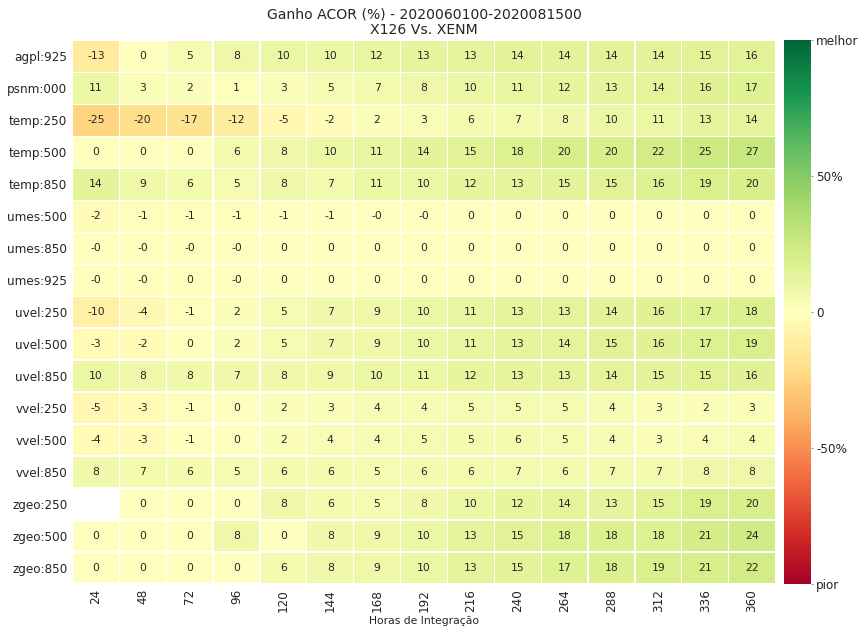
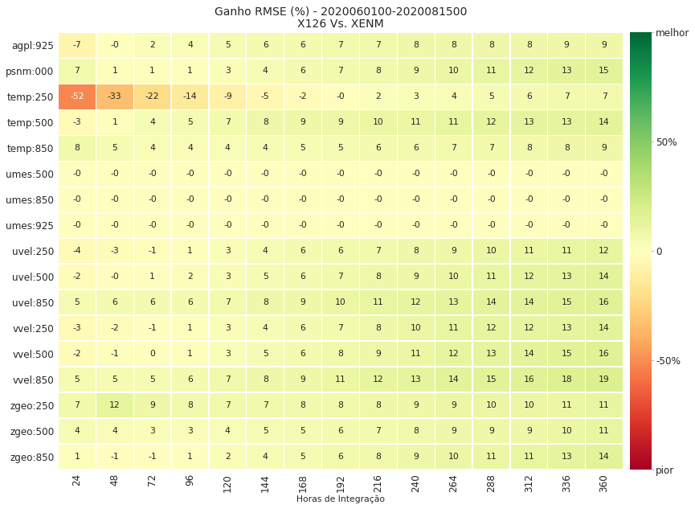
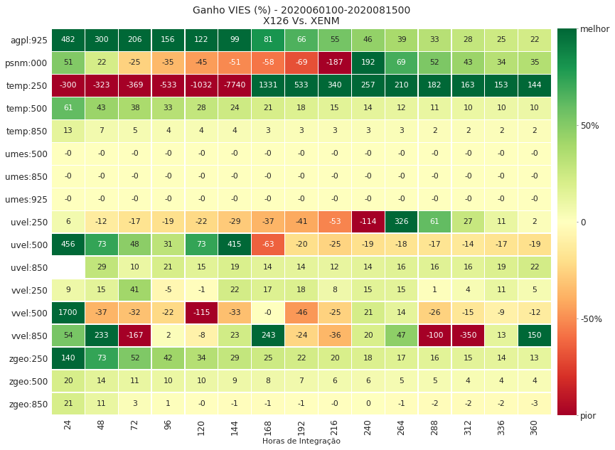
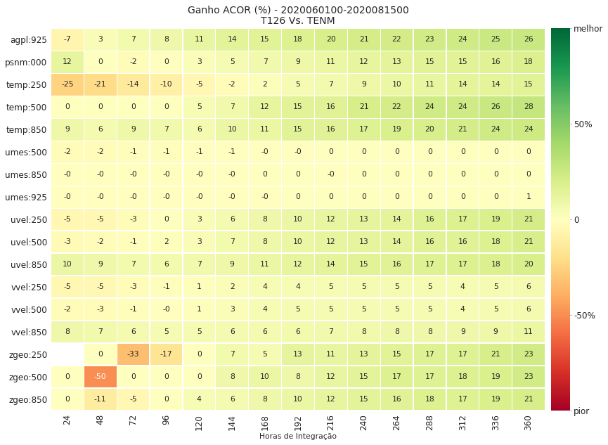
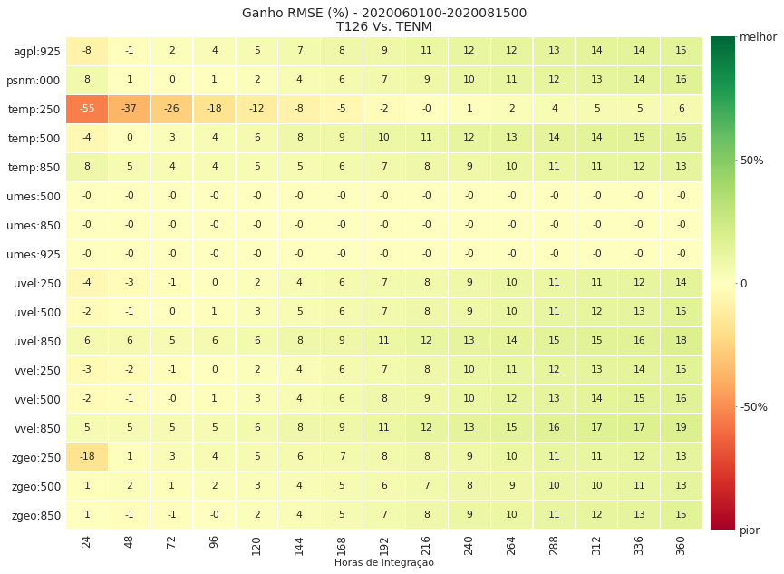
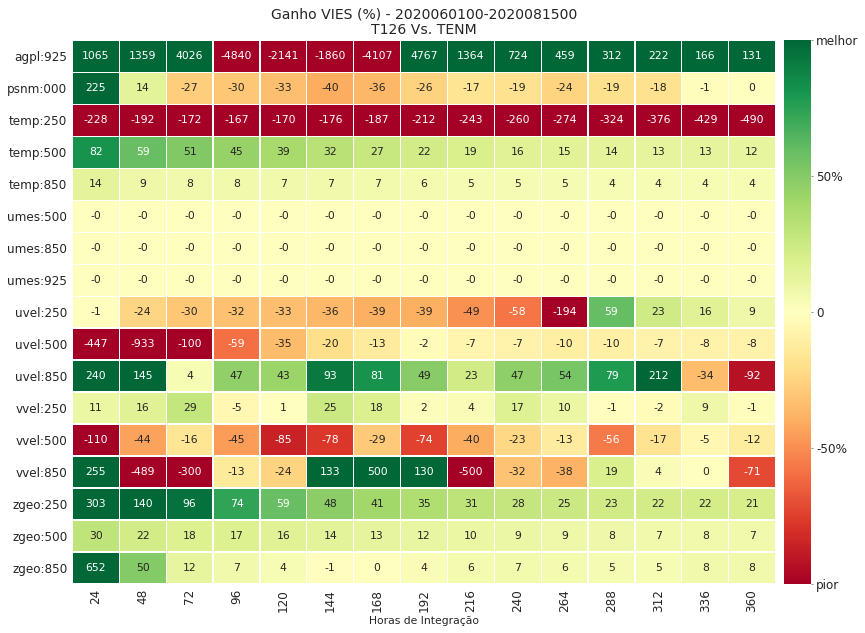
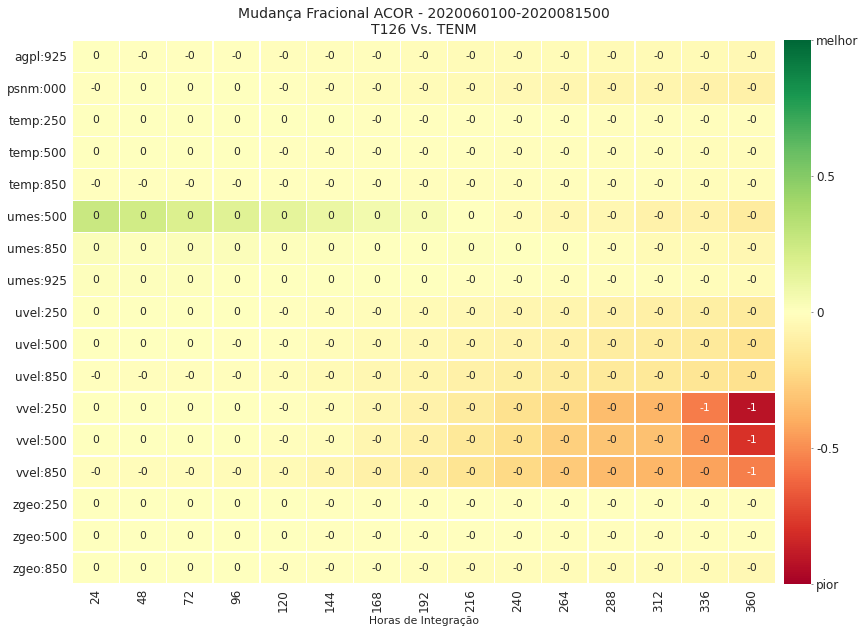
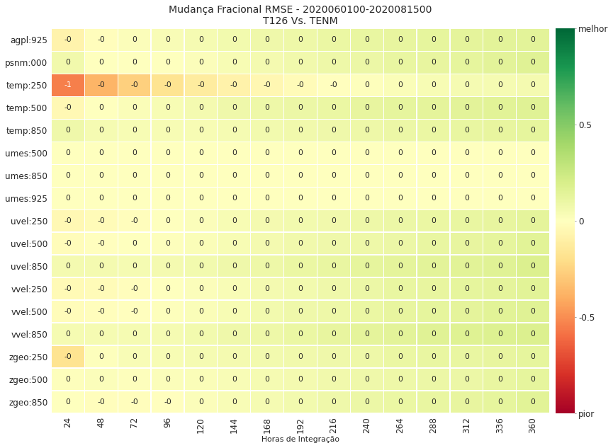
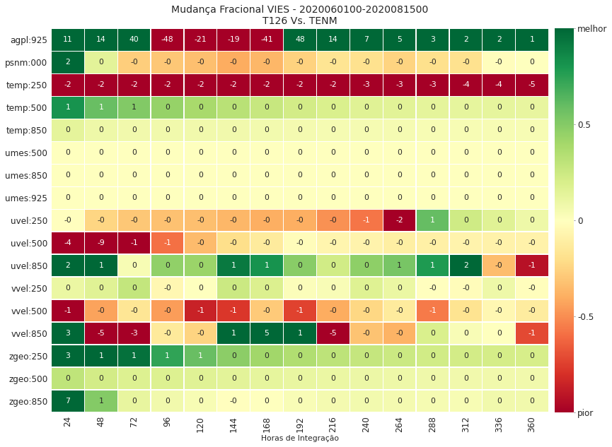

# plot_scorecard

Outra função interessante do SCANPLOT é a `plot_scorecard`. Nesta função podem ser calculadas duas métricas que permitem quantificar a variação relativa entre dois experimentos avaliados pelo SCANTEC. As métricas aplicadas são o "Ganho Percentual[^1]" e a "Mudança Fracional" e ambas podem ser calculadas com base nas tabelas de estatisticas do SCANTEC. Estas métricas podem ser utilizadas quando se quiser ter uma visão imediata sobre as melhorias obtidas entre duas versões de um modelo ou entre dois experimentos de um mesmo modelo.

O Ganho Percentual é definido por:

$$\text{GP}_{\text{STAT}} = \frac{\text{EXP2}_{\text{STAT}} - \text{EXP1}_{\text{STAT}}}{\text{EXP}_{\text{perfeito}} - \text{EXP1}_{\text{STAT}}} \times 100$$

onde,

* $\text{EXP1}$: tabelas do experimento 1;
* $\text{EXP2}$: tabelas do experimento 2;
* $\text{STAT}$: pode ser o VIES, RMSE ou ACOR;
* $\text{EXP}_{\text{perfeito}}$: valor considerado quando o experimento é perfeito, ie., 0 quando VIES ou RMSE e 1 quando ACOR.

A Mudança Fracional é definida por:

$$\text{MF}_{\text{STAT}} = 1 - \frac{\text{EXP2}_{\text{STAT}}}{\text{EXP1}_{\text{STAT}}}$$

onde,

* $\text{EXP1}$: tabelas do experimento 1;
* $\text{EXP2}$: tabelas do experimento 2;
* $\text{STAT}$: pode ser o VIES, RMSE ou ACOR;

[^1]: [BAÑOS, I. H.](http://lattes.cnpq.br/6820161737155390); et al. **Impacto da Assimilação de Perfis de Refratividade do  Satélite Metop-B nas Previsões de Tempo do CPTEC/INPE Durante os Meses de Janeiro e Agosto de 2014.** Disponível em [link](https://www.scielo.br/scielo.php?script=sci_arttext&pid=S0102-77862018000100065).

Para aprender a utilizar a função `plot_scorecard`, utilize o comando a seguir:

=== "Comando"

    ```python linenums="1"
    help(scanplot.plot_scorecard)
    ```

=== "Resultado"

    ```python linenums="1"
    Help on function plot_scorecard in module plot_functions:
    
    plot_scorecard(dTable, Vars, Stats, Tstat, Exps, outDir, **kwargs)
        plot_scorecard
        ==============
        
        Esta função calcula o "Ganho Percentual*" e a "Mudança Fracional*" a partir 
        das estatísticas do SCANTEC e plota os resultados na forma de um scorecard. 
        São necessários dois experimentos.
        
        *Banos et al., 2018: Impacto da Assimilação de Perfis de Refratividade do 
                             Satélite Metop-B nas Previsões de Tempo do CPTEC/INPE 
                             Durante os Meses de Janeiro e Agosto de 2014.
        
        Parâmetros de entrada
        ---------------------
            dTable : objeto dicionário com uma ou mais tabelas do SCANTEC;
            Vars   : lista com os nomes e níveis das variáveis;
            Stats  : lista com os nomes das estatísticas a serem processadas;
            Tstat  : tipo de score a ser calculado;
            outDir : string com o diretório com as tabelas do SCANTEC.
        
        Parâmetros de entrada opcionais
        -------------------------------
            showFig : valor Booleano para mostrar ou não as figuras durante a plotagem:
                      * showFig=False (valor padrão), não mostra as figuras (mais rápido);
                      * showFig=True, mostra as figuras (mais lento);
            saveFig : valor Booleano para salvar ou não as figuras durante a plotagem:
                      * saveFig=False (valor padrão), não salva as figuras;
                      * saveFig=True, salva as figuras;
            figDir  : string com o diretório onde as figuras serão salvas;
            tExt    : string com o extensão dos nomes das tabelas do SCANTEC:
                      * tExt='scan' (valor padrão), considera as tabelas do SCANTEC;
                      * tExt='scam', considera os nomes das tabelas das versões antigas do SCANTEC.
        
        Resultado
        ---------
            Figuras salvas no diretório definido na variável outDir ou figDir. Se figDir não
            for passado, então as figuras são salvas no diretório outDir (SCANTEC/dataout).
        
        Uso
        ---
            import scanplot 
            
            data_vars, data_conf = scanplot.read_namelists("~/SCANTEC")
            
            dataInicial = data_conf["Starting Time"]
            dataFinal = data_conf["Ending Time"]
            Vars = list(map(data_vars.get,[*data_vars.keys()]))
            Stats = ["ACOR", "RMSE", "VIES"]
        
            Exps = ["EXP1", "EXP2"]
        
            outDir = data_conf["Output directory"]
        
            figDir = data_conf["Output directory"]
            
            dTable = scanplot.get_dataframe(dataInicial,dataFinal,Stats,Exps,outDir)
            
            scanplot.plot_scorecard(dTable,Vars,Stats,'ganho',Exps,outDir,figDir=figDir,showFig=True,saveFig=True)
        
        Observações
        -----------
            Nos scorecards, as cores sempre indicam os ganhos do segundo experimento com relação ao primeiro.
            Portanto, os tons mais intensos de verde, indicam que o 'EXP2' apresentam maior ganho em relação 
            ao 'EXP1' ou que a mudança fracional é maior.
    ```    

Como o scorecard tem a premissa de resumir as estatísticas calculadas indicando para quais variáveis e quando um experimento é melhor ou pior do que outro, é interessante considerar todas as variáveis contidas nas tabelas (pode-se escolher qualquer quantidade ou estatística). Neste caso, são considerados apenas os dois experimentos, `EXP1` e `EXP2`. Para isso, incrementamos a lista `Vars` com os índices das variáveis que serão utilizadas. Nas figuras a seguir, observe que as comparações devem sempre ser interpretadas da seguinte forma: a melhora/piora do `EXP2` em relação ao `EXP1`.

=== "Comando"

    ```python linenums="1"
    Vars = list(map(data_vars.get,[*data_vars.keys()]))
    ```

A função `plot_scorecard` é então aplicada da seguinte forma:


=== "Comando"

    ```python linenums="1"
    scanplot.plot_scorecard(dTable, Vars, Stats, 'ganho',
                            Exps, outDir, figDir=figDir,
                            showFig=True, saveFig=True)
    ```

=== "Resultado"
    
    
        
    
        
    
    

Para avaliar o ganho entre os demais experimentos, basta redefinir a lista `Exps` indicando o par de experimentos que se deseja avaliar. Por exemplo:

=== "Comando"

    ```python linenums="1"
    Exps = ['T126', 'TENM']

    scanplot.plot_scorecard(dTable, Vars, Stats, 'ganho',
                            Exps, outDir, figDir=figDir, 
                            showFig=True, saveFig=True)
    ```

=== "Resultado"
    
    
        
    
    
    
        

Como indicado pela documentação, a função `plot_scorecard` está preparada para plotar os scorecards a partir do ganho percentual (indicado pelo parâmetro `ganho` passado para dentro da função) e a partir do mudança fracional (indicado pelo parâmetro `fc` passado para dentro da função). Veja no exemplo a seguir os scorecards da mudança fracional obtidos a partir das tabelas do SCANTEC, indicadas pelo parâmetro `Stats`:

=== "Comando"

    ```python linenums="1"
    scanplot.plot_scorecard(dTable, Vars, Stats, 'fc',
                            Exps, outDir, figDir=figDir, 
                            showFig=True, saveFig=True)
    ```

=== "Resultado"
    
    
        
    
        
    
