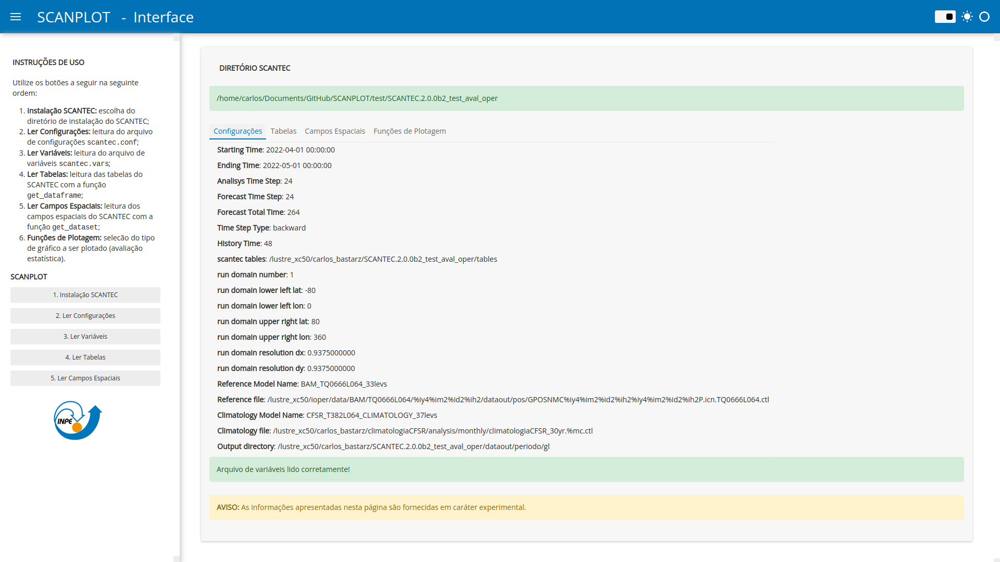
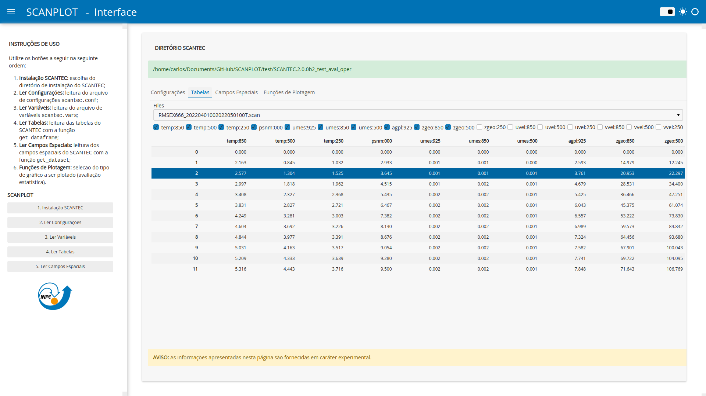
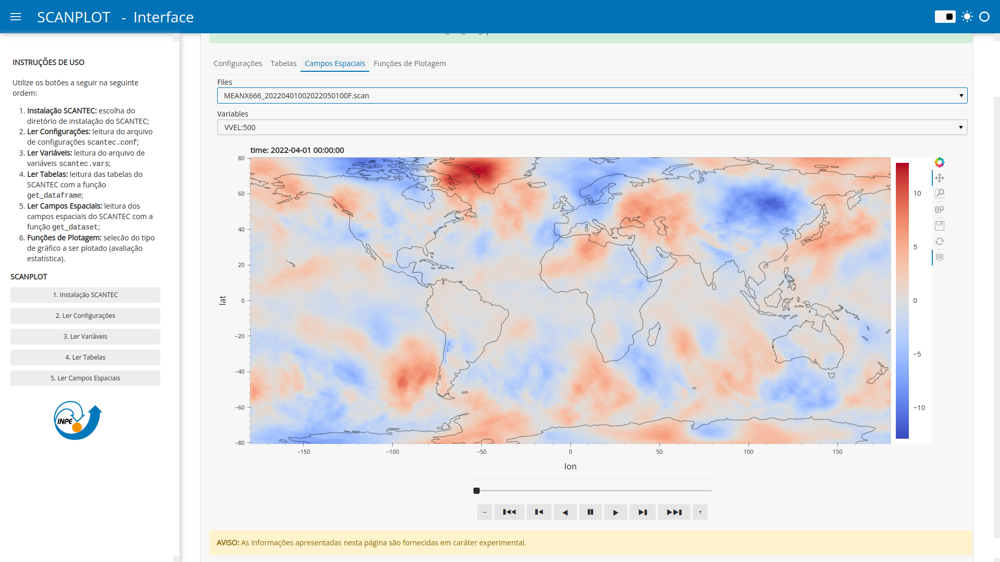

# Interface Gráfica do SCANPLOT

Com o lançamento da V1.1.0, está disponível uma interface gráfica mínima para a inspeção das tabelas e dos arquivos com a distribuição espacial das estatísticas. A partir da interface ainda não é possível executar as funções de plotagem do SCANPLOT, o que deverá ser feito nas próximas versões do programa.

Há duas formas de carregar a interface gráfica do SCANPLOT:

1. Pelo terminal:

    === "Comando"

        ```Bash linenums="1"
        conda activate SCANPLOT
        panel serve SCANPLOT_panel_app.py --autoreload
        ```

2. Pelo Jupyter notebook:

    === "Comando"
    
        ```Python linenums="1"
        import scanplot as sc
        sc.show_interface()
        ```
    
Note que através do terminal, é necessário ativar o ambiente `SCANPLOT` antes de executar a interface gráfica. Em ambos os casos, a interface gráfica será executada no navegador da máquina. As figuras a seguir apresentam os principais aspectos da interface gráfica:


Figura - Leitura das Configurações e Variavés do SCANTEC.


Figura - Leitura das Tabelas com as Estatísticas calculadas.


Figura - Leitura dos Arquivos Binários com a Distribuição Espacial das Estatísticas calculadas.

A principal vantagem da interface gráfica está na falicidade de se explorar os resultados do SCANTEC sem a necessidade de se utilizar comandos do SCANPLOT para ler os arquivos de configuração e plotar os resultados do SCANTEC. Para que isso seja possível, a interface executa as funções do SCANPLOT (apresentadas ao longo deste notebook) por meio de botões e menus para a seleção dos arquivos e variáveis.
